# SmartHLS Error Correction Code (ECC) Demo

This example illustrates a simple ECC demo that is built based on [AN4891: Error Detection and Correction on RTG4 LSRAM Memory Application Note](https://ww1.microchip.com/downloads/aemDocuments/documents/FPGA/ApplicationNotes/ApplicationNotes/Error_Detection_and_Correction_on_RTG4_LSRAM_Memory_AN4891.pdf). Users are encouraged to try out the original application note.

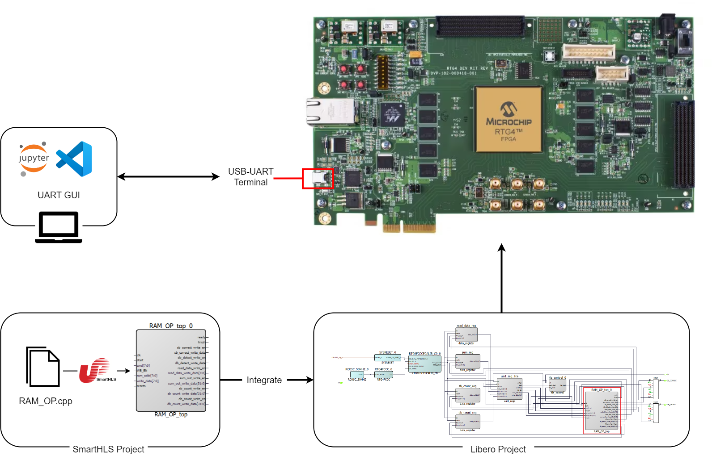

## Prerequisites
- Libero® SoC 2024.2 (or later) with ModelSim
    - [Download](https://www.microchip.com/en-us/products/fpgas-and-plds/fpga-and-soc-design-tools/fpga/libero-software-later-versions) 
- SmartHLS 2024.2 (or later): this is packaged with Libero
- Python 3.11.9 and install required packages
    - run `pip install -r requirements.txt` in `ECC_demo` folder

This document uses the Windows versions of Libero® SoC 2024.2 and SmartHLS 2024.2. Depending on the version you use, the results generated from your Libero® SoC and SmartHLS could be slightly different from that presented in this document.

We assume you have already completed some of the HLS trainings, understand how to create a SmartHLS project, and knows how to generate an HLS module from C++ source code. We highly recommand you to read through the ECC related sections in [SmartHLS User Guide](https://onlinedocs.microchip.com/v2/keyword-lookup?keyword=hls_ug&redirect=true&version=latest):
- [Error Correction Code](https://onlinedocs.microchip.com/v2/keyword-lookup?keyword=hls_ecc&redirect=true&version=latest)
- [Error Correction Code (ECC) Library](https://onlinedocs.microchip.com/v2/keyword-lookup?keyword=hls_ecc_library&redirect=true&version=latest)

The following hardware is required:
- [RTG4 Development Kits](https://www.microchip.com/en-us/development-tool/rtg4-dev-kit)

The following Libero cores are required, please download them in advance:
- RTG4FCCCECALIB, version 2.2.009
- RTG4FCCC, version 2.0.204

# Overview
This demo design will cover the following topics:
- Design and generate ECC protected RAM with different operations using SmartHLS
- Verify and test SmartHLS generated module with ECC Simulation feature
- Verify and test on RTG4 board using SmartDebug to inject single-bit and multi-bit errors

The image below illustrates the overall design of the ECC demo.

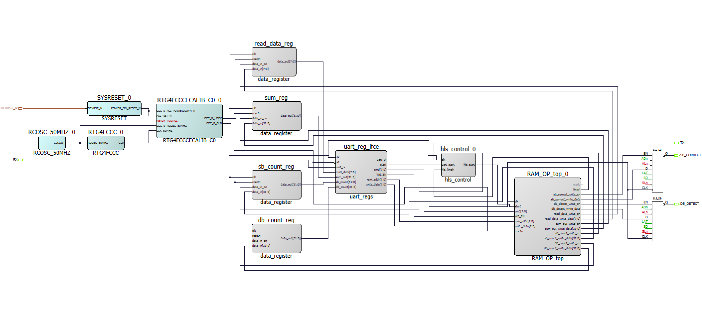

## HLS Module - RAM_OP_top
`RAM_OP_top` is the module genereted by SmartHLS. It takes in a user input command from UART interface and performs different operations accordingly. More information on the HLS module `RAM_OP_top` will be discussed in [HLS Module Overview](README.md/#hls-module-overview).

## UART Interface – uart_regs
The UART Interface module is generated using [VHDL registers UART test interface generator - VHDLwhiz](https://vhdlwhiz.com/product/vhdl-registers-uart-test-interface-generator/). The command used is the following:
```
python gen_uart_regs.py start=1:out cmd=8:out WB_EN=1:out ram_addr=8:out write_data=8:out read_data=8:in sum_out=32:in sb_count=32:in db_count=32:in
```
The UART interface recieves commands from the HLS Module `RAM_OP_top` and transmits the output values stored in the data registers 

## Clocking and Reset
This demo design uses 80 MHz clock and active low reset for all modules. For more information on clocking structure and reset structure, please refer to [AN4891](https://ww1.microchip.com/downloads/aemDocuments/documents/FPGA/ApplicationNotes/ApplicationNotes/Error_Detection_and_Correction_on_RTG4_LSRAM_Memory_AN4891.pdf).

## hls_control Module
This is a helper module that controls the start signal of the HLS module. It takes in the UART start signal (`uart_start`) and HLS finish signal (`hls_finish`) as input and output the start signal for HLS module (`hls_start`).

## Data Registers
There are 4 simple data registers, `read_data_reg`, `sum_reg`, `sb_count_reg` and `db_count_reg`for storing the output values from `RAM_OP_top`.

## LED Ports
When detected `sb_correct` or `db_detect` flags, the corresponding LED port will turn on, with LED1 for `db_detect` and LED8 for `sb_correct`. Note that if there is single-bit error and reading with write-back is enabled, LED port will not be turned on (or will quickly flash and disappear) because the `sb_correct` flag will be reset after written back the corrected data.

# HLS Module Overview

## RAM_OP.cpp

In `RAM_OP.cpp`, we first included the ECC library header file and instantiated an ECC protected memory `ecc_ram` that has 256 elements, each element 8 bits wide. ECC feature is enabled by setting `ecc(true)` in the memory pragma.
```
#include "hls/ecc.hpp"

...

#define N 256
#pragma HLS memory impl variable(ecc_ram) ecc(true)
ap_uint<8> ecc_ram[N];
```

Moving on to the top-level function, module `RAM_OP` recieves a user input command and perform the corresponding operation on the ECC protected memory `ecc_ram`. Available operations are the following:
- `RAM_CLEAR`: set all RAM content to 0
- `RAM_INIT`: initialize the RAM with incremental data from 0 to 255
- `READ`: read from the given address, increment ECC counters accordingly. If WB_EN=1 and is single-bit correction error, then perform a write back 
- `WRITE`: write data to the give address
- `CLEAR_COUNT`: reset ECC counters to 0
- `SUM`: sum up all elements in the RAM (from i=0 to i=255)
- `SB_INJ`: inject a single bit error at i=2, mask = 0x0001 (simulation only)
- `DB_INJ`: inject a double bit error at i=4, mask = 0x0011 (simulation only)

> **NOTE:** Due to the limitation that error injection calls must take in compile time constant numbers for address and mask, injections are fixed to specific address and masks.

In the helper function `read_op`, we use `read_ecc` to access the memory instead of directly calling `ecc_ram[i]`. The call to `read_ecc` returns a data wrapper ecc_out that contains the data read from memory and the ECC signals. The ECC signals are used to increment the corresponding counters `sb_count` and `db_count`.

### Testbench
Function `main` is the testbench. In `main`, we call the top-level function `RAM_OP` multiple times, each time with a different command, and compare the results with expected values. We use SmartHLS ECC error injection feature to verify the correctness of the design in simulation. 

First, the RAM block is initialized with incremental data and perform a `SUM` operation without any errors. Next, we inject a single-bit error, then a double-bit error, and verify the read data output and ECC error counters after each error injection operation. You should expect to see `sb_count = 1` and `db_count = 1` in the console output. Finally, we perform a `SUM` operation with the injected errors and verify the result. 

## config.tcl
As described in [Clocking and Reset](README.md/#clocking-and-reset), we are using 80 MHz clock and active low reset. Thus, we added the following lines to `config.tcl`:
```
set_parameter CLOCK_PERIOD 12.5
set_parameter ACTIVE_LOW_RESET 1
```

We also included `set_parameter ECC_ERROR_INJECTION_ON 1` in configuration to enable the ECC error injection feature that is used for simulation verification. 

# Running the Example

## 1. Generate and Verify the HLS Module
Open SmartHLS 2024.2. Import `SmartHLS_Project` into SmartHLS. Refer to [Import the SmartHLS Projects into SmartHLS](../Training1/readme.md/#import-the-smarthls-projects-into-smarthls) from Training 1 for how to import projects.


The error injection operations are simulation-only and are wrapped with predefined macro `SIMULATION`. Depending on the memory access pattern, ECC error injection calls may have effect on number of simulation cycles. To avoid any effects on simulation cycles, you should comment out line 8, `#define SIMULATION`, when generating the final RTL that will be programmed to the FPGA board. 

Run **Compile Software to Hardware** to generate RTL modules from the C++ source files. 

The report file `summary.hls.RAM_OP.rpt` should open automatically. Scroll down to Memory Usage section, you will see `ecc_ram` is instantiated as a LSRAM with ECC enabled.

```
+---------------------------------------------------------------------------------------------------------------------------------+
| Local Memories                                                                                                                  |
+---------------------+-----------------------+---------------------------------+-------------+------------+-------+--------------+
| Name                | Accessing Function(s) | Type                            | Size [Bits] | Data Width | Depth | Read Latency |
+---------------------+-----------------------+---------------------------------+-------------+------------+-------+--------------+
| RAM_OP_db_count_reg | RAM_OP                | Register                        | 32          | 32         | 1     | 0            |
| RAM_OP_sb_count_reg | RAM_OP                | Register                        | 32          | 32         | 1     | 0            |
| ecc_ram             | RAM_OP                | RAM (LSRAM - Non-Pipelined ECC) | 2048        | 8          | 256   | 1            |
+---------------------+-----------------------+---------------------------------+-------------+------------+-------+--------------+
```

Run **SW/HW Co-Simulation** to verify the generated RTL. You should see the following in the console output, indicating the generated RTL is functionally correct:

```
Info: Verifying RTL simulation
Retrieving hardware outputs from RTL simulation for RAM_OP function call 1.
Retrieving hardware outputs from RTL simulation for RAM_OP function call 2.
Sum 1: 32640
ECC count 1: 0
Retrieving hardware outputs from RTL simulation for RAM_OP function call 3.
Retrieving hardware outputs from RTL simulation for RAM_OP function call 4.
ecc_ram[2] =  2
sb_count = 1
db_count = 0
Retrieving hardware outputs from RTL simulation for RAM_OP function call 5.
Retrieving hardware outputs from RTL simulation for RAM_OP function call 6.
ecc_ram[4] =  7
sb_count = 1
db_count = 1
Retrieving hardware outputs from RTL simulation for RAM_OP function call 7.
Sum 2: 32643
ECC count 2: 4
PASS!
+----------------+-----------------+--------------------------+----------------------------+-----------------------+
| Top-Level Name | Number of calls | Simulation time (cycles) | Call Latency (min/max/avg) | Call II (min/max/avg) |
+----------------+-----------------+--------------------------+----------------------------+-----------------------+
| RAM_OP_top     | 7               | 833                      | 7 / 266 / 118.86           | 7 / 266 / 94.33       |
+----------------+-----------------+--------------------------+----------------------------+-----------------------+
Simulation time (cycles): 833
SW/HW co-simulation: PASS
```

## 2. Generate Libero Project
Open Libero v2024.2, and go to `Project -> Execute Script`. Choose `/libero_scripts/script.tcl` as the script file and and leave arguments empty. Running the script will generate the Libero project with required modules (HLS module, clocking and reset, etc.), imports all the constraints, runs synthesis, place & route, and verify timing, and creates the programming job file.

The programming job file can be found at `Libero_Project/designer/top/export/top.job`. Follow the instructions in [Appendix B: Program the Board using FlashPro Express](README.md/#appendix-b-program-the-board-using-flashpro-express) to program RTG4 board with the generated job file.


## 3. Running the Demo Design

### Setup the Demo Design
SmartDebug GUI is used to inject single-bit or multi-bit errors into the specified memory location of LSRAM. Follow the instructions below to open SmartDebug GUI. 
1. In the generated Libero project in the Libero SoC software, double click on the **SmartDebug Design** in the design flow.

    
2. In the SmartDebug GUI, click **Debug FPGA Array**.
3. In the Debug FPGA Array window, go to the **Memory Blocks** tab. It shows the LSRAM block in the design with a logical and physical view. Logical blocks are shown with an L icon, and physical blocks are shown with a P icon.
4. Select the physical block instance and right click **Add**.

    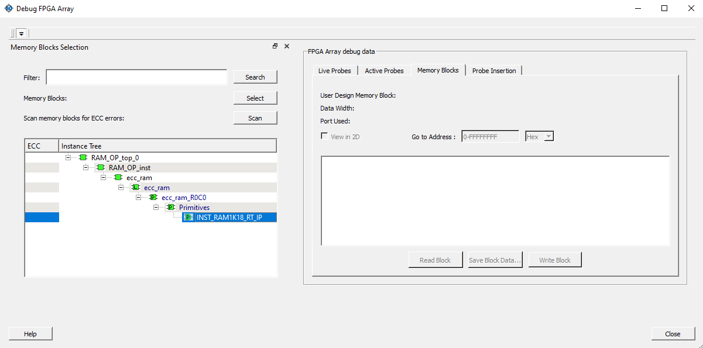
5. To read the memory block, click **Read Block**.

Next, open the Jupyter Notebook `uart.ipynb` in VS Code (refer to [Appendix C: Setup Jupyter Notebook in VS Code](README.md/#appendix-c-setup-jupyter-notebook-in-vs-code)). Click **Run All**, and the following UART GUI interface will show up:

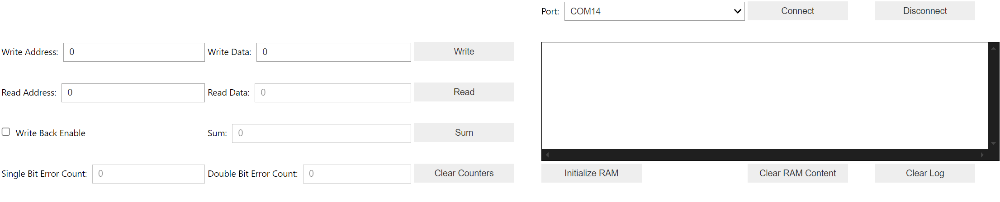


1. Choose the correct COM port from the dropdown list (check device manager if unsure), and click Connect. You should see message `'Opening UART_PORT: COM14 at baud rate: 115200'` printed in the log console.
2. Click **Initialize RAM** to store incremetal data into the RAM. You can verify this by clicking on **Read Block** in SmartDebug GUI to check the memory block content of the FPGA.
3. Click on **Sum**. You should see the output to be 32640, the result of summing up 0 to 255.

    

### Injecting Single-bit or Multi-bits Errors
1. Switch to SmartDebug GUI and click **Read Block**.
2. Inject 1-bit error in the 8-bit data at any location of LSRAM up to depth 256. In the following figure, we injected a 1-bit error at address=0002.

    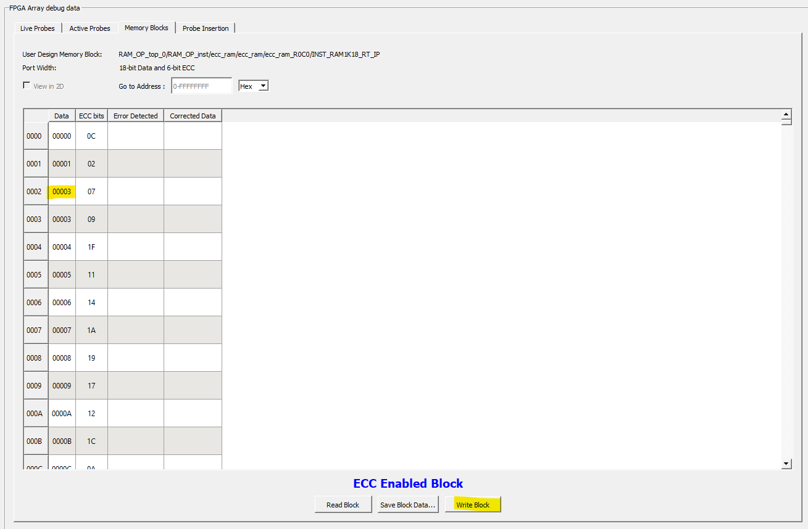
3. Click Write Block in order to write the modified data to the intended location.
4. If you click on **Read Block**, you will see single-bit error is detected and will be corrected to 0002, as shown in the image below

    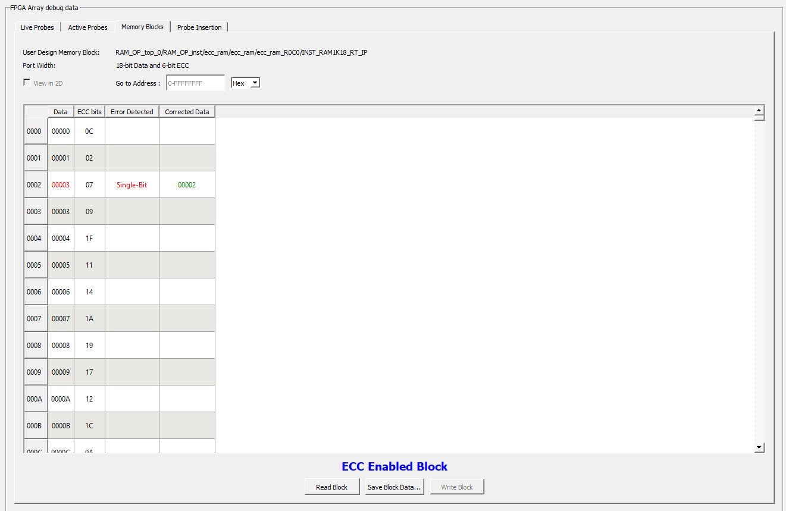
5. Now swtich to the UART GUI interface. Put in 2 for **Read Address** and click **Read**. The output **Read Data** is 2 since single-bit errors will be corrected, and **Single Bit Error Count** increased to 1. Looking at the RTG4 board, you will see LED8 lighting up. Note that when single-bit error was detected, the read data output is corrected but data in the RAM location is not updated. If you click on **Read Block** in SmartDebug GUI, you will still see the single bit error present.

    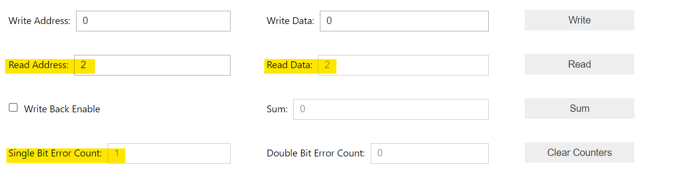
6. In the UART GUI interface, check **Write Back Enable** and perform a read operation on address 2 again. You will see **Single Bit Error Count** increased to 2, since we detected another single-bit error. Click on **Read Block** in SmartDebug GUI, this time the single bit error is removed.

    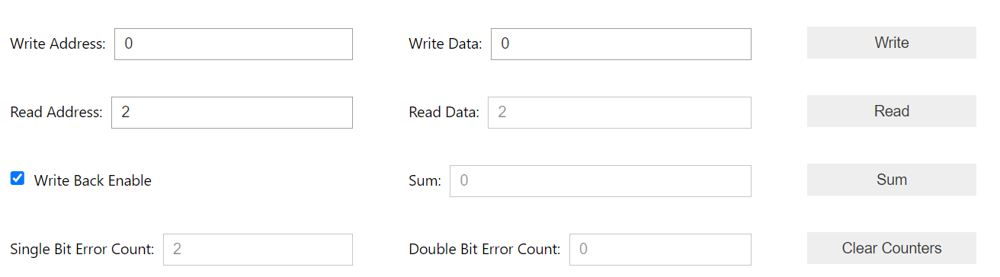
7. Now we try inject a double-bit error. Select Data bits for address 4 in SmartDebug GUI, change it to 0007 and click on **Write Block**.

    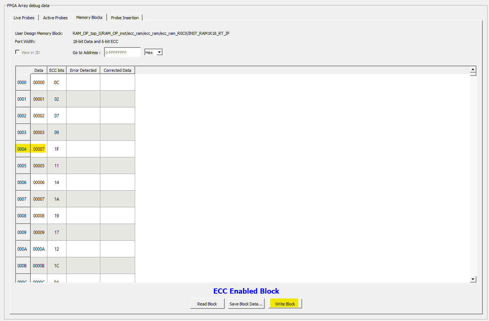
8. Click on **Read Block** again. This time you will see Multi-bit error detected.

    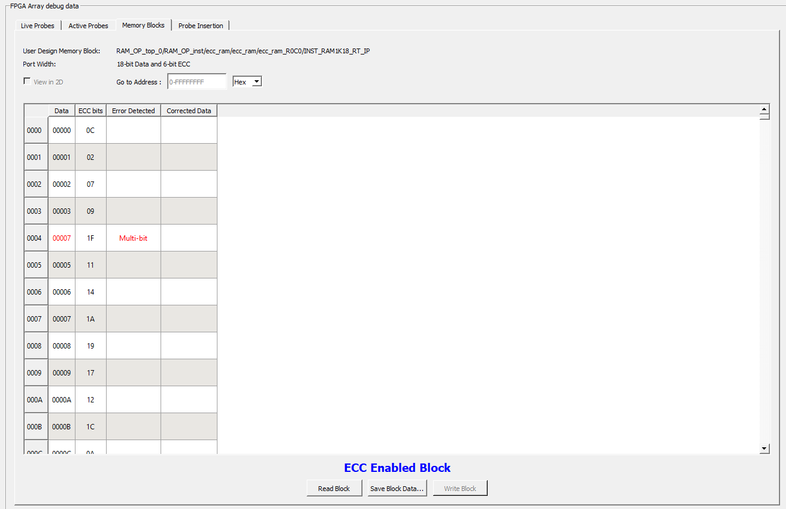
9. Switch back to UART interface GUI. Put in 4 for **Read Address** and click **Read**. The output **Read Data** is 7, the same as what we injected in step 7, and **Double Bit Error Count** increased to 1. Looking at the RTG4 board, you will see LED1 lighting up. This time the error is not correctable so we see the errored data in output.

    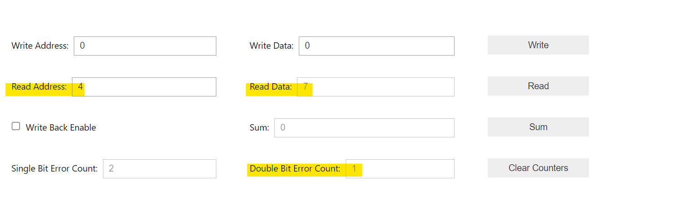

> **NOTE:** SmartDebug directly communicate with the board through the SmartDebug (JTAG) interface. The LSRAM read and write operation through SmartDebug bypass the controller modules and no ECC counters will be updated. 

# Appendices

## Appendix A: Setup RTG4 Development Kits
1. Connect the jumpers on the RTG4 Development Kit, as shown in the following table.

    |Jumper|Pin (From)|Pin (To)|Comments|
    |---|---|---|---|
    |J11, J17, J19, J21, J23, J26, J27, and J28|1|2|Default
    |J16|2|3|Default|
    |J32|1|2|Default|
    |J33|1|3|Default|
    |J33|2|4|Default|
    
    Important: Switch OFF the power supply switch, SW6, while connecting the jumpers.
2. Connect the USB cable (mini USB to Type-A USB cable) to J47 of the RTG4 Development Kit and other end of the cable to the USB port of the host PC.
3. Ensure that the USB to UART bridge drivers are automatically detected. This can be verified in the device manager of the host PC. The following figure shows the connected COM14 Port.

    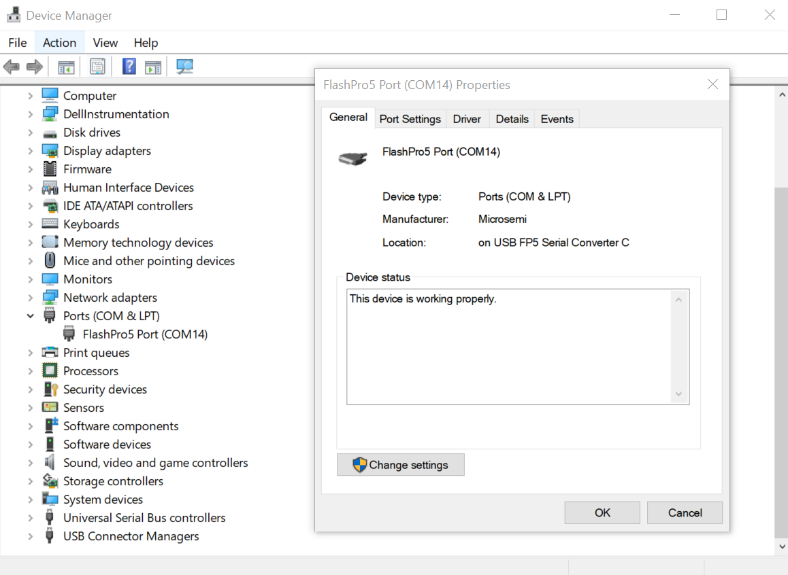

The following figure shows the board setup for running the EDAC demo on the RTG4 Development Kit.


## Appendix B: Program the Board using FlashPro Express
1. Following the instruction in [Appendix A: Setup RTG4 Development Kits](README.md/#appendix-a-setup-rtg4-development-kits) to setup RTG4 board.
2. Open FlashPro Express.
3. Select Project and New Job Project.
   
   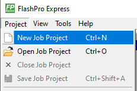
4. Now select the generated job file to import it.
5. Enter a project location. Click OK.
6. Now the Programmer window will open. If you do not see the Programmer for the RTG4 Development Board, then click Refresh/Rescan Programmers.

    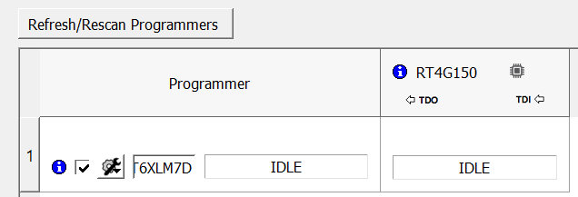
7. Now click the RUN button to program the FPGA.
8. After programming you should see the RUN PASSED. Now power cycle the board and close FlashPro Express.
    
    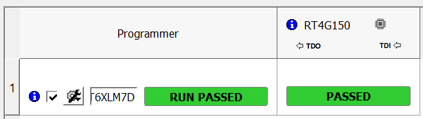

## Appendix C: Setup Jupyter Notebook in VS Code
Follow this tutorial from VS Code to set up environment for Jupyter Notebooks in VS Code: https://code.visualstudio.com/docs/datascience/jupyter-notebooks

