# Automatic On-Chip Instrumentation

## Requirements

Before beginning this tutorial, you should install the following software

* Libero® SoC 2024.2 or later with ModelSim, Identify, and SmartHLS

The following steps must also be performed

* Place `<SMARTHLS_INSTALLATION_DIRECTORY>/SmartHLS/dependencies/python` on the PATH

  * On Linux, run

    ```console
    $ export PATH="<SMARTHLS_INSTALLATION_DIRECTORY>/SmartHLS/dependencies/python:$PATH"
    ```

  * On Windows PowerShell, run

    ```console
    > $env:PATH = "<SMARTHLS_INSTALLATION_DIRECTORY>\SmartHLS\dependencies\python;$env:PATH"
    ```

* Set the environment variable `SHLS_ROOT_DIR` to point to `<SMARTHLS_INSTALLATION_DIRECTORY>/SmartHLS`.
  * In Linux, run

    ```console
    $ export SHLS_ROOT_DIR="<SMARTHLS_INSTALLATION_DIRECTORY>/SmartHLS"
    ```

  * In Windows PowerShell, run

    ```console
    > $env:SHLS_ROOT_DIR = "<SMARTHLS_INSTALLATION_DIRECTORY>\\SmartHLS"
    ```

  * **NOTE**: On Windows machines, please either use **forward slashes (/) or double back slashes (\\\\)** for this path.

The following hardware is required

* PolarFire® SoC FPGA Icicle Kit. Please follow [this link](https://onlinedocs.microchip.com/oxy/GUID-AFCB5DCC-964F-4BE7-AA46-C756FA87ED7B-en-US-13/GUID-1F9BA312-87A9-43F0-A66E-B83D805E3F02.html) to set up your Icicle Kit.

NOTE: Libero 2024.2 is shipped with both ModelSim and QuestaSim. ModelSim is the default, but auto-instrumentation will work with both. For the purposes of this example, we will be using ModelSim.

NOTE: As this is an advanced example, we assume completion of the previous training modules (in the [examples repository](https://github.com/MicrochipTech/fpga-hls-examples)), as well as experience using ModelSim, Identify, and the command-line.

## TL;DR

To instrument any SmartHLS design, add

```Makefile
HLS_INSTRUMENT_ENABLE=1
```

to your `Makefile`.

## About the Auto-Instrumentation Flow

The objective of this feature is to streamline the debugging process for designs utilizing SmartHLS-generated modules. To facilitate instrumentation, this tool generates TCL scripts to instrument the ports and HLS FIFO modules for each top-level function within a SmartHLS project. These auto-generated TCL scripts can be seamlessly integrated into the SmartHLS SoC Flow. Additionally, to enhance the debugging process, the tool creates a template for ModelSim's waveform viewer that organizes and sorts instrumented signals, and offers a Python API for extended FIFO monitoring.

Here is a high-level visual of the auto-instrumentation flow.

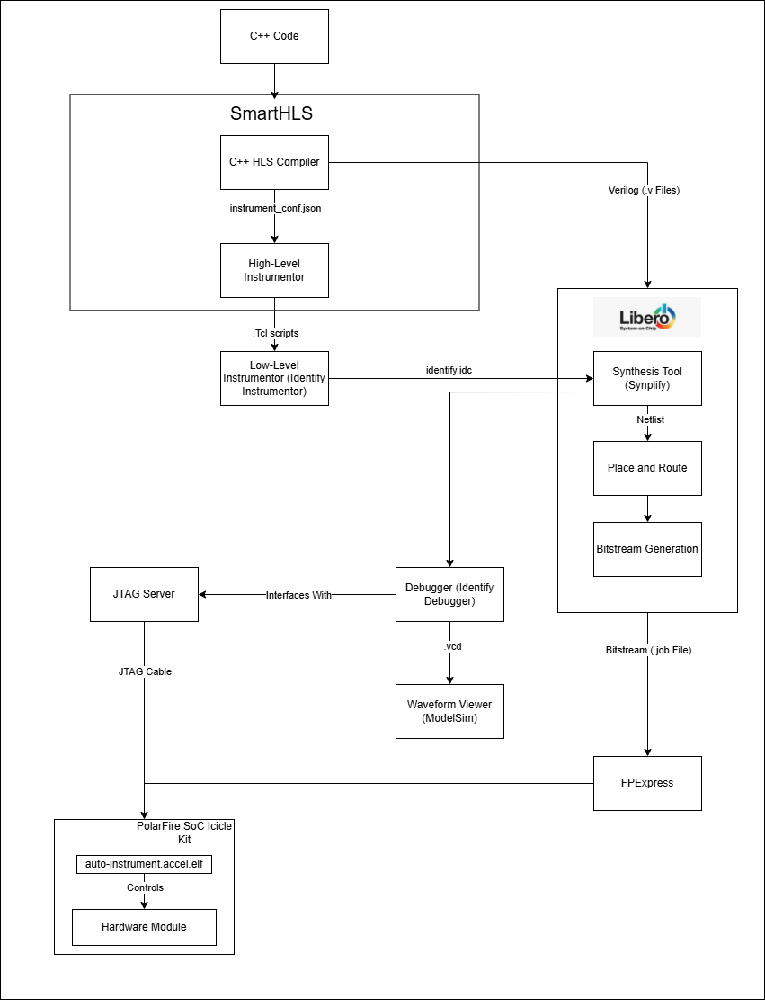

The flow starts with a user writing C++ code. The SmartHLS compiler uses the C++ code to generate HDL code (Verilog/VHDL) and the compiler can automatically generate an initial high-level specification of all the top-level functions in the HLS project to be instrumented. The user can optionally edit the generated file before proceeding to the instrumentation process.

The generated HDL code is used by Libero to generate a netlist. The High-Level Instrumentor will extract the design hierarchy for each instance of each top-level module and FIFOs in the netlist by querying the RTL Synthesis tool (e.g. `synplify_pro`). Then, the High-Level Instrumentor will use the high-level specification (`instrument_conf.json` file) provided by the user to decide which signals should be instrumented, and generate Tcl scripts to be used by the Low-Level Instrumentor tool (e.g. Identify Instumentor) to instrument them. The Low-Level instrumentor will modify the FPGA design (e.g. inserting the actual on-chip analyzer modules) via the netlist. The FPGA CAD tool will continue to the place and route process, all the way to bitstream generation. At this point the design has been automatically instrumented.

Once the bitstream is programmed into the FPGA, the user can open the debugger tool to arm triggers on specific conditions and capture data (debugging mode). Alternatively, the user can start the automatic periodic triggering process that will constantly capture data from the instrumented design (Monitoring Mode). These files are then read by the Update Wave Viewer script, which retrieves the files, concatenates them and, transforms them from the .vcd file format to another format adequate to the viewer (e.g., `.wlf` files for ModelSim).

The High-Level Instrumentor also generates additional Tcl scripts (commands) for the waveform viewer to configure how each signal that was instrumented should be displayed. This display configuration groups each signal by top-level, automatically sets addresses and data busses signals to use hex notation, and for the FIFO monitoring mode configuration, displays FIFO occupancy levels (the usedw signal) as an analog waveform to simplify the visualization of the FIFO usage over time.

In debugging mode, a user will need to press Ctrl+R to refresh the waveform visualizer with new captured data. In monitoring mode, as the automatic periodic triggering process continues to produce captured data, new data will be appended to the end of the current waveform.

## Explaination of the Example Design

We wish to build an example that showcases the power of auto-instrumentation, while keeping things simple.

In Training 2 and the Canny_RISCV demo, we saw that we can use dataflow paralellism to overlap functions when run in sequence.

For this example, we have created a simple yet general design that shows how auto-instrumentation is useful. We will follow the analogy of a waterfall, where there is a continuous water source (call it the *producer*), and the water falls into a container, that spills into another container, that spills into another container, that spills into a final container, that spills away into its final destination (call it the *consumer*). The producer can be turned off (using a faucet or switch), ceasing the flow of the waterfall. Also, the containers can get filled up initally to a certain amount, before they spill into the next container (we call this the initial delay).

Let's relate this back to this design. In this design, the containers are FIFOs. There will be four FIFOs, called `fifo1`, `fifo2`, `fifo3`, and `fifo4`. `fifo1` will continuously, while the switch is on, get elements pushed into it by the `producer()` function. In parallel, a function called `fifoToFifo()` will accept two FIFOs, `fifo1` and `fifo2`, as arguments. It will wait for the first element to appear in `fifo1` before starting a countdown for the initial delay (defined by the user), before pushing elements from `fifo1` to `fifo2` (`fifo1` will continue receiving elements during the initial delay). Replicated versions of `fifoToFifo()` will perform the same with `fifo2` and `fifo3`, and `fifo3` and `fifo4`. Then, a function called `consumer()` will, similar to `fifoToFifo()`, wait for the first element to appear in `fifo4` and then start a delay (again, defined by the user), before continuously dumping elements of `fifo4`. This produces a "stream" similar to our waterfall example.

Also in this design is an implementation of the switch controlling the `producer()` function. There will be a 1-byte block of on-chip memory (through an AXI4 Target) containing either 0 or 1, called `go`. If it contains 1, then the switch is on, meaning the accelerator can run. If it contains 0, then the switch is off, meaning the accelerator must cease operation. When the user halts the program (by sending `SIGINT` to the executable, through pressing Ctrl + C), the switch will become 0. This will signal to the `producer()` function that it should stop pushing elements into `fifo1` and, in addition, send a special "stop-code" down the pipeline (`0x0FF`) before exiting. When the `fifoToFifo()` and `consumer()` functions see this stop-code, they too will pass it down the pipeline and then exit, effectively ceasing operation of the entire pipeline.

Here is a simplified visual of the design.

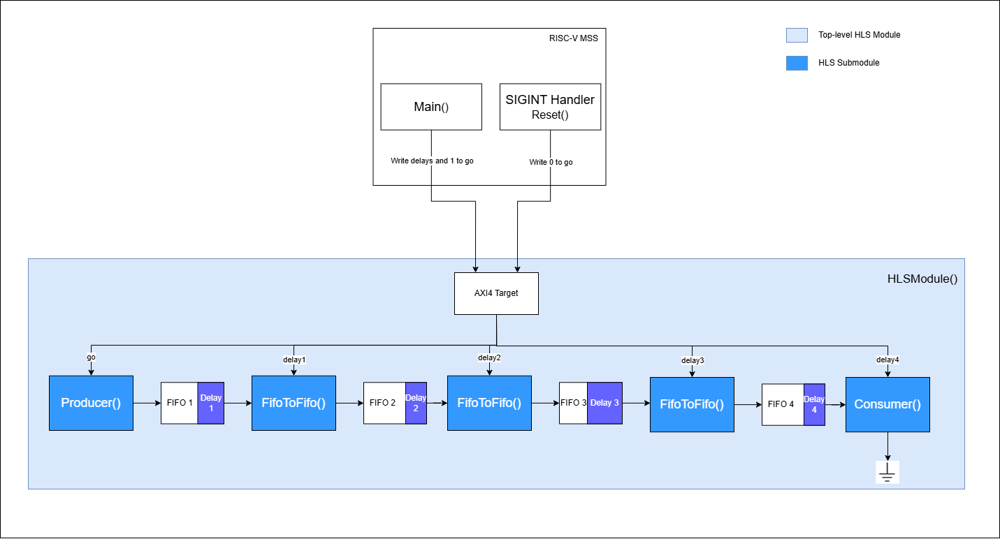

Notice that the delays specified by the user will actually determine the occupancy that each FIFO stays at while the pipeline is in its steady state. For example, if `delay1` (the delay that applies to the `fifoToFifo()` function connecting `fifo1` and `fifo2`) is 0, then in theory, we should see `fifo1` having a maximum occupancy of 1. If it is 10, then the maximum occupancy of `fifo1` will, in theory, be 11.

We can confirm this design works as we expect using Automatic On-Chip Instrumentation.

## Part 0: Setup

First enable insrumentation by opening `Makefile` and adding the following line

```Makefile
HLS_INSTRUMENT_ENABLE=1
```

In a new terminal, remove stale files by running

```console
$ shls clean
```

Then run

```console
$ shls -a instrument_init
```

This will generate a file called `instrument_conf.json`.

This is what the `instrument_conf.json` file will look like:

```json
{
    "modules": {
        "hlsModule": {
            "log_level": "2",
            "fifo_log_level": "0"
        }
    },
    "dashboard": {
        "max_iterations": -1,
        "show_markers": 1,
        "monitoring_mode": 0,
        "waveform_period": "10"
    },
    "iice_options": {
        "sample_buffer_depth": 1024,
        "iice_name": ""
    }
}
```

`instrument_conf.json` uses the output of the `shls hw` command to get the top-level modules of the design, meaning `shls instrument_init` has `shls hw` as a pre-requisite. As such, make sure to clean your project and re-run `shls instrument_init` if you modify the top-level modules of your design. An explanation of the parameters of `instrument_conf.json` is located in the [User Guide](https://onlinedocs.microchip.com/oxy/GUID-AFCB5DCC-964F-4BE7-AA46-C756FA87ED7B-en-US-13/GUID-0BA4F982-F732-459D-8CAB-C02B0E92879F.html#GUID-0BA4F982-F732-459D-8CAB-C02B0E92879F__GUID-F622374A-37E3-440B-922A-7980536D3130).

Now, let's change the log levels related to `hlsModule()`. A lower log level means fewer signals will be instrumented, which in turn saves resources. The same property applies to the FIFO log level. Let's change `log_level` to 3, and the `fifo_log_level` to 3.

```json
"hlsModule": {
            "log_level": "3",
            "fifo_log_level": "3"
        }
```

For the sake of this example, we will only demonstrate log levels 3 and 3 (respectively), but a description of each log level is located in the [User Guide](https://onlinedocs.microchip.com/oxy/GUID-AFCB5DCC-964F-4BE7-AA46-C756FA87ED7B-en-US-13/GUID-0BA4F982-F732-459D-8CAB-C02B0E92879F.html#GUID-0BA4F982-F732-459D-8CAB-C02B0E92879F__GUID-4D55BBE5-2C4C-4533-BA42-68622188A166).

Also, this project name has a hyphen (-) in it, and this character is not allowed in the IICE name. Since an empty value for `iice_name` means that the `iice_name` will be `IICE_<PROJECT DIR NAME>`, we will end up encountering errors during synthesis (due to the hyphen). So, we should change this name to include an underscore (_), rather than a hyphen.

In `instrument_conf.json`, please change 

```json
"iice_options": {
        "sample_buffer_depth": 1024,
        "iice_name": ""
    }
```

to

```json
"iice_options": {
        "sample_buffer_depth": 1024,
        "iice_name": "auto_instrument"
    }
```

Finally, run Synthesis, Place-and-Route, and generate the bitstream

```console
$ shls -a soc_accel_proj_pnr
```

NOTE: Excluding the part about changing `iice_name` to remove the hyphen, generating `instrument_conf.json` and configuring it is totally optional. All you need to do is add the one line in the [TL;DR section](#tldr) to your `Makefile` if you would like to use the defaults (log levels 2 and 0, respectively).

Now, program the bitstream you just generated to your board using FlashPro Express. Also, at this point in time, it will be very helpful to record the following things

* The IP of the host that your board is connected to (you may use `127.0.0.1` if your board is connected to your local machine).
* The IP address of the board you have programmed the bitstream to.
* The programmer ID of the board you have programmed the bitstream to (this will be visible in FPExpress).

We will use this information throughout the tutorial.

Please make sure you close FPExpress after flashing the bitstream, as it will interfere with the Actel JTAG server.

Now, on the same machine that your board is connected to, launch a new terminal and start the Actel JTAG server. You can choose any unoccupied port. but please remember which port you use.

```console
$ acteljtag -p <PORT>
```

NOTE: In Windows, if you see an error upon running this command, you may have to use the fully qualified PATH of `acteljtag`. You can find this in Windows PowerShell using

```console
> Get-Command acteljtag
```

Now close all open terminals.

## Part 1: Debugging Mode

After the previous command finishes executing, notice that a new file `hls_output/soc/synthesis/identify.idc` has been generated. The presence of this file should serve as confirmation that the design was actually instrumented. Inside will be all the signals that are being instrumented. For example, you may notice the line

```text
{/FIC_0_PERIPHERALS_1/hlsModule_top_0/hlsModule_inst/hlsModule_BB_0_fifo1_inst/genblk1/fwft_fifo_bram_inst/empty}\
```

This is a signal that indicates whether or not `fifo1` is empty. If it is high, then `fifo1` is empty. Ideally we would like to start the monitoring process when this signal goes from high to low, which would indicate that `fifo1` is non-empty.

Now we need to configure the signals we will be triggering on. When a certain event happens to that signal, Identify will start recording data for a certain period of time, which we can view in ModelSim.

On Linux, run

```console
$ identify_debugger_shell -licensetype identdebugger_actel -shell
```

On Windows, run

```console
> identify_debugger_console -licensetype identdebugger_actel
```

This should open the interactive shell for the Identify Debugger. In this shell, execute the following commands:

First, set the `project_directory` variable to point to the example directory:

```console
% set project_directory "<PATH TO PROJECT DIRECTORY>"
```

NOTE: On Windows, make sure you replace any backslash (\\) in the above path with double backslashes (\\\\).
Now we'll open the project:

```console
% project open "$project_directory/hls_output/soc/synthesis/MPFS_ICICLE_KIT_BASE_DESIGN_syn.prj"
```

And then we'll point Identify to the Actel JTAG server running on the machine that your board is connected to

```console
% server set -addr <IP OF MACHINE CONNECTED TO YOUR BOARD> -port <ACTELJTAG PORT>
```

Now connect to the server

```console
% server start
```

We'll also get Identify connected to the specific board you're using. First, set the `programmer_id` variable to be the programmer ID of your board.

```console
% set programmer_id <PROGRAMMER_ID>
```

And then run

```console
% com check
% chain add $programmer_id 5
% chain select $programmer_id
% com check
```

Now, we'll need to tell Identify that we'll be using ModelSim to view the waveforms.

```console
% waveform viewer modelsim
```

Next, we'll pick a signal to trigger on. Ideally, we'd like to start recording the values of signals once the hardware accelerator actually starts running. This is typically when `fifo1`'s `empty` signal switches from high to low, indicating that data has entered the pipeline. So, we'll trigger on this signal.

```console
% watch enable -language verilog  {/FIC_0_PERIPHERALS_1/hlsModule_top_0/hlsModule_inst/hlsModule_BB_0_fifo1_inst/genblk1/fwft_fifo_bram_inst/empty} {1'b1} {1'b0}
```

Finally, run the debugger.

```console
% run -iice {auto_instrument}
```

Now wait until you see

```shell
Running...
```

in the shell.

This will wait until `inputFifo`'s `empty` signal becomes low (0), and will then record the values of all instrumented signals for some period of time. which will be used by ModelSim to display the waveforms.

To run the design on the board, open a new terminal and run

```console
$ shls -a soc_sw_compile_accel
```

This will cross-compile the software with the hardware drivers. Finally, you should transfer the generated `hls_output/auto-instrument.accel.elf` executable over to the board, and then execute it on the board. You will need to pass the four delays as command-line arguments to the executable. For now, pass in 0 for all four delays.

When you run the executable on-board, this will cause `fifo1` to become non-empty which will, in turn, trigger in Identify.

Finally, back in the Identify shell, write the data to a `.vcd` file. First press ENTER, and then input

```console
% write vcd "$project_directory/hls_output/soc/synthesis/auto_instrument.vcd" -iice auto_instrument
```

Now in a new terminal window, launch ModelSim by running

```console
vsim -do hls_output/scripts/instrument/vsim_keyboard_shortcut
```

Now, open the ModelSim window and press Ctrl + R to refresh.

You should see the signals for FIFOs arranged and grouped in an intuitive manner. You can expand the `User_Defined_FIFOs` group to see the signals for the FIFOs in the design. For example, here's the grouped signals for `fifo1` (after toggling on leaf names)

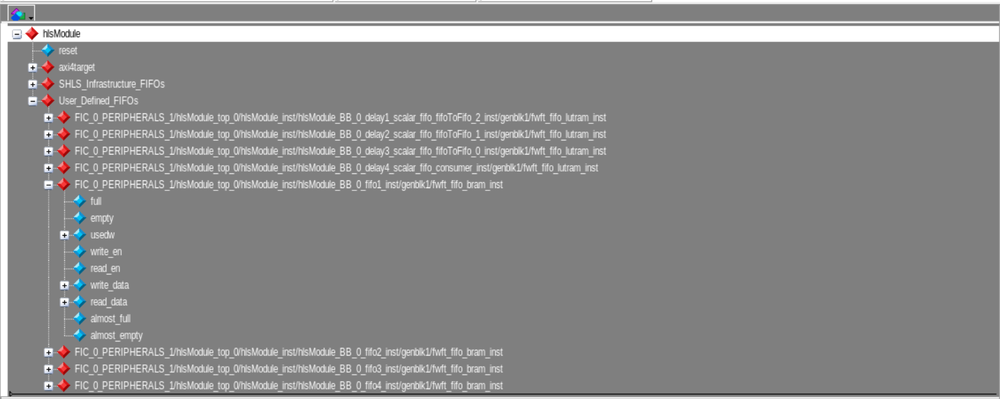

Let's take a look at the `empty` and `write_data` signals for `fifo1`, and compare these signals to the corresponding counterparts for `fifo2`, `fifo3`, and `fifo4`. Since we launched the accelerator with all delays 0, we expect to see that the time between two consecutive FIFOs becoming non-empty is very small. Place a cursor at falling edge of the `empty` signal for all the FIFOs. You may have to zoom in a little to get it right. For clarity, we'll remove all the other signals for now, so that we can see the four `empty` signals on top of each other.

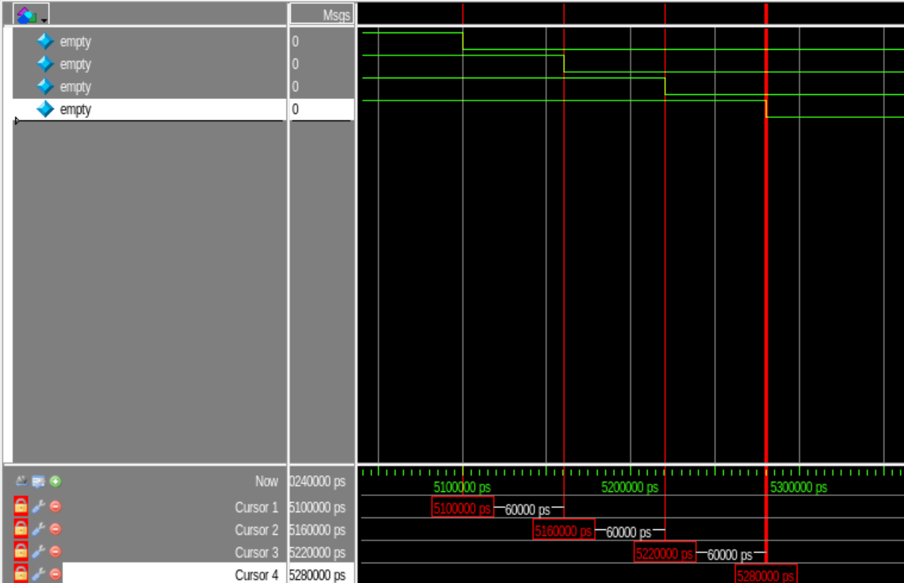

Notice that the delay between the falling edges is 60ns. Since a clock cycle is 10ns, 60ns is 6 clock cycles. The reason for this offset in delay is due to some of the control logic in the code. In general, expect

* A 6-cycle delay when the delay is 0
* An (9 + N)-cycle delay when the delay is N, for some positive integer N.

To confirm this, kill the executable running on the board (Ctrl + C), arm the debugger, and then rerun the program with all delays set to 1. Then, refresh ModelSim (Ctrl + R), and replace the cursors as before. You should see the difference is 9 + 1 = 10 clock cycles

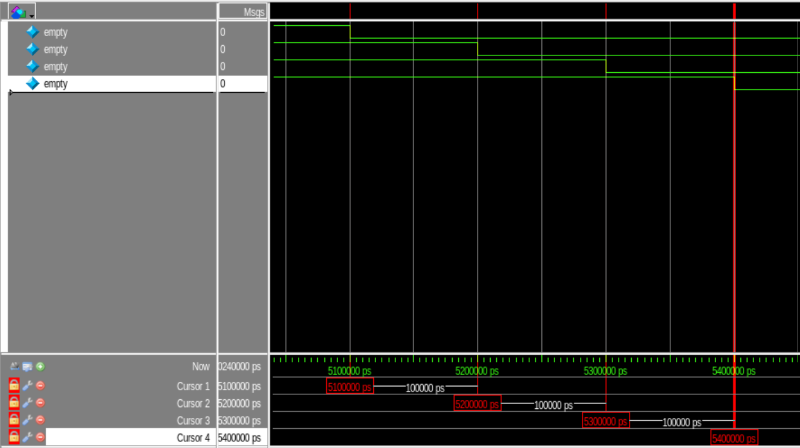

Exercise: Try with different delays to make sure the design works.

When the SIGINT signal is sent to the executable running on the board, the `producer()` function should write `0x0FF` (wordplay for "OFF") to `fifo1` and terminate. When `0x0FF` is seen by the other functions in the pipeline, they too will terminate, effectively ceasing operation of the pipeline completely. Let's confirm this is actually the case.

In the Identify shell, remove the existing trigger.

```console
% watch disable  {/FIC_0_PERIPHERALS_1/hlsModule_top_0/hlsModule_inst/hlsModule_BB_0_fifo1_inst/genblk1/fwft_fifo_bram_inst/empty}
```

Then, trigger on `0x0FF` being written to `fifo1`:

```console
% watch enable -language verilog  {/FIC_0_PERIPHERALS_1/hlsModule_top_0/hlsModule_inst/hlsModule_BB_0_fifo1_inst/genblk1/fwft_fifo_bram_inst/write_data} {32'h0FF}
```

Now run the debugger

```console
% run -iice {auto_instrument}
```

And then, kill the running executable on the board (Ctrl + C).

Then, in the Identify shell, write to the `.vcd` file by pressing ENTER then running

```console
% write vcd "$project_directory/hls_output/soc/synthesis/auto_instrument.vcd" -iice auto_instrument
```

Then, refresh ModelSim (Ctrl + R).

You should see the FIFOs becoming empty at the tail-end of the waves.

Let's check what was written to `fifo1` just before it became empty. Look at the last falling edge of `write_en`, and place a cursor just before it (this is the location of the last write). You will have to zoom in.

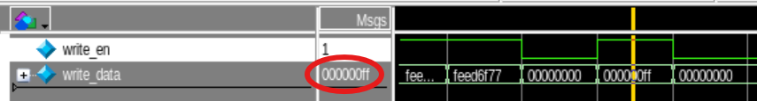

Indeed, we see that the last written message is `0x0FF`, exactly what we expect!

Exercise: Confirm that all the FIFOs eventually get `0x0FF` written to them and that they become empty. Also check that the messages written to the FIFOs prior was `0x11FE<SOME NUMBER>`.

A very important signal we have not yet mentioned is the `usedw` signal. This signal counts the number of elements in the FIFO at any given point in time. In this design, we expect that the occupancy of each FIFO grows during the inital delay stage, and then remains constant until the executable running on-board is killed, in which case it will become empty. We'll examine the `usedw` signal for when the FIFO occupancy is growing (when you first start the accelerator), and leave the examination of the `usedw` signal when the FIFO size is shrinking as an exercise to the reader.

First, remove the trigger you currently have set in the Identify shell.

```console
% watch disable  {/FIC_0_PERIPHERALS_1/hlsModule_top_0/hlsModule_inst/hlsModule_BB_0_fifo1_inst/genblk1/fwft_fifo_bram_inst/write_data}
```

Then, add a trigger for `fifo1` becoming non-empty

```console
% watch enable -language verilog  {/FIC_0_PERIPHERALS_1/hlsModule_top_0/hlsModule_inst/hlsModule_BB_0_fifo1_inst/genblk1/fwft_fifo_bram_inst/empty} {1'b1} {1'b0}
```

Then, run the debugger

```console
% run -iice {auto_instrument}
```

Finally, run the executable on the board with all delays 12, then execute
Then, in the Identify shell, write to the `.vcd` file by pressing ENTER then running

```console
% write vcd "$project_directory/hls_output/soc/synthesis/auto_instrument.vcd" -iice auto_instrument
```

in the Identify shell to write to the `.vcd`, and then refresh ModelSim (Ctrl + R).

First, let's format the `usedw` signal for `fifo1` in ModelSim. Right-click it and hover over "Format", then select "Analog (automatic)". Then, right-click it again and hover over "Radix", then select "Decimal".

Now you can place a cursor anywhere in the waveform and see the occupancy level of `fifo1`. You will see that the occupancy at the pipeline's stable state is 20. This is because the initial delay of 12 causes an actual delay of 21 clock cycles. In these 21 clock cycles, 20 elements were able to be written before `fifo2` started reading from `fifo1` (due to the inital delay expiring). In general, xpect the ith FIFO to contain

* 5 elements if the ith delay is 0
* 8 + N elements if the ith delay is N (for some positive integer N)

This explains why we see an occupancy of 20 in `fifo1` when `delay1` is 12

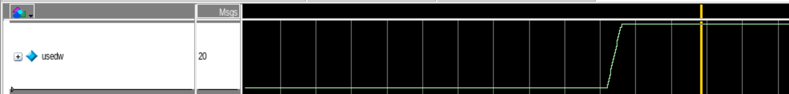

Exercise: Play around with the delays and check that the occupancies of the other FIFOs makes sense intuitively.

Now close ModelSim and the Identify Debugger console.

## Part 2: Monitoring Mode With ModelSim

So far, anytime we wanted to test a new delay, we'd have to manually arm the Identify trigger, write to the `.vcd` file, and refresh ModelSim.

For a more long-term setting, you may wish to have the debugger find any new data it can, and have the waveforms in ModelSim update automatically with this data. You can accompolish this using Monitoring Mode.

To enable Monitoring Mode, change

```text
set monitoring_mode 0
```

to

```text
set monitoring_mode 1
```

in `hls_output/scripts/update_vcd.tcl`. This indicates to the waveform updating scripts that when we get new data from the debugger, we don't want to refresh the waveform, but rather want to add the new data to the end of the existing waveform. Then, open a new terminal and run

```console
$ identify_debugger_shell -licensetype identdebugger_actel <PROJECT DIRECTORY>/hls_output/scripts/instrument/monitor.tcl <PROGRAMMER ID>
```

Finally, open a new terminal and run

```console
$ vsim -do <PROJECT DIRECTORY>/hls_output/scripts/instrument/update_vcd.tcl
```

This will launch ModelSim again, but it will update continuously and Identify will trigger on any available signal.

Now close ModelSim and the Identify Debugger console.

## Part 3: Monitoring Mode --- FIFO Monitoring Dashboard

When writing C++ to design a hardware accelerator, it may not be clear at first how deep your FIFOs need to be. On the one hand, if they are too shallow, then you will have a lot of data backup (bottleneck). And, if they are too deep, then you are wasting area.

The FIFO Monitoring Dashboard aims to show developers, in nearly real-time, how filled up their FIFOs are getting as their program executes. It does so in an intutitive manner using a bar graph, where each bar represents a FIFO. It consists of two parts: a monitoring process and a visualizing process. The monitoring process triggers the debugger repeatedly. The visualizing process reads the sample dump from the debugger process, and then extracts and visualizes the occupancy of the FIFOs.

To use it, first enable Monitoring Mode if you haven't done so already, by changing

```text
set monitoring_mode 0
```

to

```text
set monitoring_mode 1
```

in `hls_output/scripts/update_vcd.tcl`. This indicates to the waveform updating scripts that when we get new data from the debugger, we don't want to refresh the waveform, but rather want to add the new data to the end of the existing waveform. Then, open a new terminal and run

```console
$ identify_debugger_shell -licensetype identdebugger_actel <PROJECT DIRECTORY>/hls_output/scripts/instrument/monitor.tcl <PROGRAMMER ID>
```

Finally, open a new terminal and run

```console
$ shls -s instrument_monitor_fifos
```

This will launch the FIFO Monitoring Dashboard in a new window.

Now, when you run the executable on-board, you should see the bar graph changing according to how filled your FIFOs are. Try playing around with different delays and see how this affects the bar graphs. The occupancies should match the values you see for the `usedw` signal in ModelSim, for the FIFO dashboard is simply a visualization of this signal!

The bars will also be colour-coded, with red meaning the FIFO is completely full, yellow meaning the FIFO is either almost full or almost empty, and green meaning the FIFO is at comfortable occupancy level.

The bar graph should periodically change as it receives data from the monitoring process. The timestamp at the top of the plot indictes the time the plotted data was created by the monitoring program.

You might notice a whole bunch of FIFOs on the left of the screen with very long names. These are infrastructure FIFOs, and are part of SmartHLS's AXI hardware design. The rightmost four FIFOs are user-defined FIFOs, and the ones you'll want to pay attention to.

NOTE: This feature is still experimental and under development, so it may not be accurate.

Here are some examples of the bar plot. You should confirm these make sense intuitively.

When the executable is not running on-board:

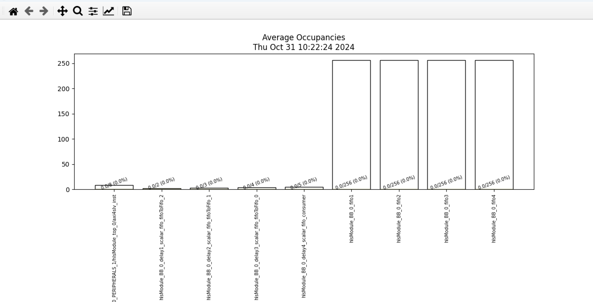

When the delays are 20, 40, 80, and 160, respectively:

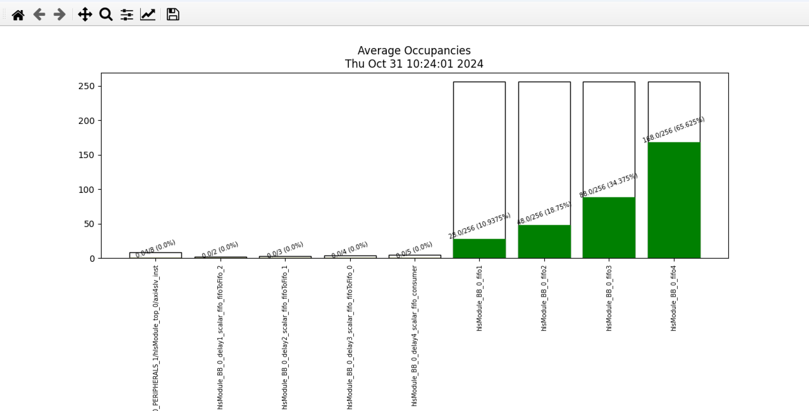

When the delays are 220, 20, 150, and 80, respectively:

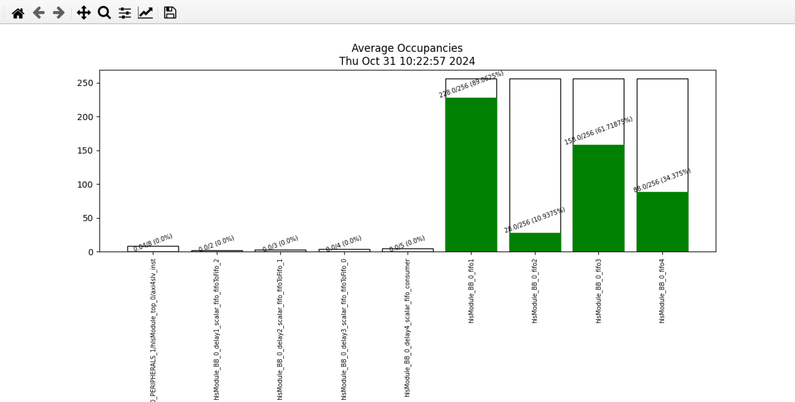

## Appendix A: Using the Identify GUI

In this tutorial, we only demonstrated how to set triggers and configure the client-server connection using the Identify shell. However, all of this can also be done with the GUI. You can launch the GUI by opening a new terminal and running

```console
$ identify_debugger -licensetype identdebugger_actel <PROJECT DIRECTORY>/hls_output/soc/synthesis/MPFS_ICICLE_KIT_BASE_DESIGN_syn.prj
```

Then, you can configure the client-server connection by clicking *Debugger > Setup debugger...*, and then visiting the *Communications* tab. 

To trigger and run the debugger, you should find the correct signals you wish to trigger on, right-click it, hover over *Triggering*, and customize your trigger appropriately. Then, hit the big *Run* button at the upper-left side of the window. For example, here's how you can trigger on `fifo1` becoming non-empty and then run the debugger:

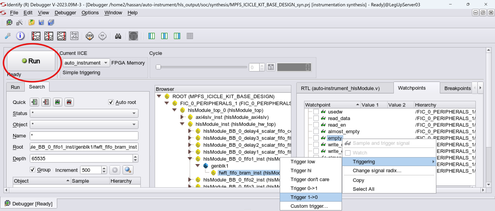
