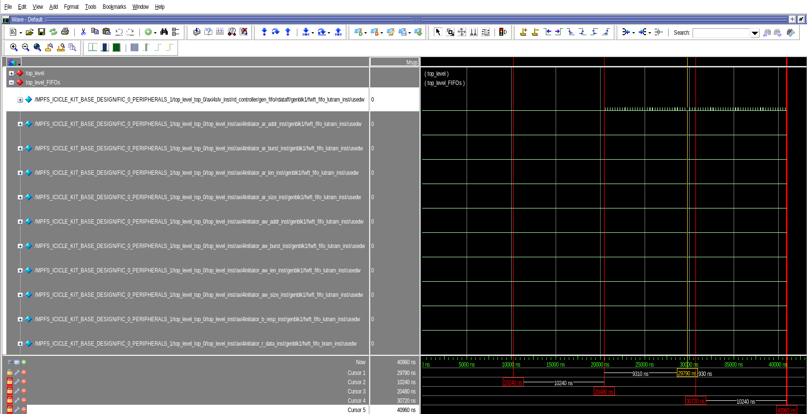

## Auto-Instrumentation

The goal of this project is to simplify the debugging process of designs that use SmartHLS-generated modules. To simplify the process of instrumentation, this tool generates TCL scripts to instrument the ports and HLS FIFO modules for each top-level function in a SmartHLS project. The auto-generated TCL scripts can be automatically sourced in the SmartHLS SoC Flow, or users can source them manually in their own custom TCL flows for Libero and FPGA Designer. To simply the process of debugging, the tool generates a template for Questasim's waveform viewer that organizes and sorts instrumented signals, and provides an API for long-term FIFO monitoring.

**NOTE:** Libero 2024.2 is shipped with both Modelsim and Questasim. Questasim is the default, but auto-instrumentation will work with both.


### More on the Auto-Instrumentation Flow...
The flow starts with a user writing C++ code. The SmartHLS compiler uses the C++ code to generate HDL code (Verilog/VHDL) and the compiler can automatically generate an initial high-level specification of all the top-level functions in the HLS project to be instrumented. The user can optionally edit the generated file before proceeding to the instrumentation process. 

The generated HDL code is used by the FPGA CAD tool (e.g. Libero or FPGA Designer) to generate a netlist. The High-Level Instrumentor will extract the design hierarchy for each instance of each top-level module and FIFOs in the netlist by querying the RTL Synthesis tool (e.g. synplify_pro). Then, the High-Level Instrumentor will use the high-level specification (instrument_conf.json file) provided by the user to decide which signals should be instrumented, and generate Tcl scripts to be used by the Low-Level Instrumentor tool (e.g. Identify_instumentor) to instrument them. The Low-Level instrumentor will modify the FPGA design (e.g. inserting the actual on-chip analyzer modules) via the netlist. The FPGA CAD tool will continue to the place and route process all the way to bitstream generation. At this point the design has been automatically instrumented.

Once the bitstream is programmed into the FPGA, the user can open the debugger tool to arm triggers on specific conditions and capture data (debugging mode). Alternatively, the user can start the automatic periodic triggering process that will constantly capture data from the instrumented design (monitoring mode). The triggering mechanism does not need a specific triggering condition. These files are then read by the Update Wave Viewer script, which retrieves the files, concatenates them and, transforms them from the .vcd file format to another format adequate to the viewer (e.g., .wlf files for Modelsim.) 

The High-Level Instrumentor also generates additional Tcl scripts (commands) for the waveform viewer to configure how each signal that was instrumented should be displayed. This display configuration groups each signal by top-level, automatically sets addresses and data busses signals to use hex notation, and for the FIFO monitoring mode configuration, displays FIFO occupancy levels (the usedw signal) as an analog waveform to simplify the visualization of the FIFO usage over time. 

In debugging mode, a user will need to press Ctrl+R to refresh the waveform visualizer with new captured data. In monitoring mode, as the automatic periodic triggering process continues to produce captured data, new data will be appended to the end of the current waveform.

### The Workaround for Identify Instrumentor 202309VM-2

We have identified a known issue with the latest version of Synplify's Instrumentor Shell, which affects the full automation capabilities of the SmartHLS Automatic On-Chip Instrumentation feature. When compiling a project that uses Automatic On-Chip Instrumentation on Icicle Kit, for example, you may see an error like this:

```
Running: identify_db_generator (Identify Database Generator)
Job failed on: p|rev_1
Copied C:\test\rev_1\synlog\p_identify_db_generator.srr to C:\test\rev_1\identify.srr
  
Job: "identify_db_generator" terminated with error status: 2
See log file: "C:\test\rev_1\synlog\p_identify_db_generator.srr"
  
Return Code: 2
Run Time:00h:00m:01s
Complete: identify_ui_flow
Error: Failed to generate instrumentor data base
Or the following if you are using the Synplify's Instrumentor GUI:
```

To address this, we recommend the following temporary workaround:

1. Revert to the 2024.1 version of Synplify by configuring the `HLS_SYNPLIFY_PATH` environment variable before starting the SmartHLS IDE or calling SmartHLS from the command line. 

For example, on Linux:

```
export HLS_SYNPLIFY_PATH=/c/Microchip/Libero_SoC_v2024.1/SynplifyPro/bin/synplify_pro
```

Or if you are using Powershell,

```
$env:HLS_SYNPLIFY_PATH=C:/Microchip/Libero_SoC_v2024.1/SynplifyPro/bin/synplify_pro
```

Note that the path separators are forward slashes for `HLS_SYNPLIFY_PATH`.

2. Modify the system PATH to prioritize the 2024.1 version of Synplify by prepending it to the existing PATH.
For example, on Linux:
```
export PATH=/c/Microchip/Libero_SoC_v2024.1/SynplifyPro/bin:$PATH
```

Or if you are using Windows, you will need to set this variable through the "System Properies" window.

Note that the path separators are back slashes for PATH.

### Prerequisites:

1. SmartHLS v2024.2
2. Make sure Synplify, Identify, and Questasim can be called from the command line (e.g. are on your PATH.) 
3. You'll need to use the terminal at various parts in this tutorial. If you're on Windows, from the IDE, open Powershell. 
4. You will need to install python3. You can download it at https://www.python.org/downloads/.
5. Make sure your Icicle Kit is set up according to the instructions here: https://microchiptech.github.io/fpga-hls-docs/2023.2/icicle_setup.html

It is also recommended that you go through [Training 4: SmartHLS™ Training for Microchip PolarFire® SoC Flow](https://github.com/MicrochipTech/fpga-hls-examples/tree/main/Training4) to get an idea of how the regular SoC flow (without instrumentation) works.

## The Example 
There are two flows you can use instrument your design with the auto-instrumentation tool. 

The first is the fully automated SoC flow:
- Simple, invovles adding one variable to your Makefile and running `shls soc_accel_proj_pnr`. SmartHLS will automatically handle integrating the SmartHLS-generated modules and calling the auto-instrumentation tool.
- Only currently supported for the Icicle Kit. Future work will involve adding support for other boards.

The second is the custom flow:
- This involves both integrating the SmartHLS generated modules and calling the auto-instrumentation tools yourself.
- This flow can be used on any board.

For an example of how to use the custom flow, see [LINK TO RISCV DEMO HERE : )] 

This example demonstrates the fully automated SoC flow on the Icicle Kit. We will demonstrate two aspects of the tool: debugging mode and monitoring mode.

**Parts 1 and 2 will demonstrate debugging mode:**

1. Compilation using the SoC flow, and debugging in Debugging Mode
2. More customization

**Parts 3 and 4 will demonstrate monitoring mode:**

3. FIFO Level Monitoring using Questasim for visualization
4. FIFO Level Monitoring mode with matplotlib for visualization 

**NOTE:** The auto-instrumentation tool also supports instrumenting desgins with multiple HLS top modules in one Libero project in a custom flow. For examples showcasing this feature, see [Appendix: RISC-V demo](#appendix-risc-v-demo).

:point_right:: This emoji will prefix instructions; follow the steps denoted by :point_right: to instrument your design.

### More on the Design...

Let's take a closer look at the design we'll be instrumenting:


`n_fwd_1`, `n_wait_1`, `n_fwd_2`, and `n_wait_2` are read in from the `my_cfg.cfg` file:

```
1            
0            
1            
0            
```
The first line is `n_fwd_1`, the second line is `n_wait_1`, the third line is `n_fwd_2`, and the last line is `n_wait_2`.

Let's run this example in `cosim` for an idea of what to expect when we run it on the board.

:point_right: 1. Go to the `hls` directory, and run `shls clean` to get rid of any stale files.

:point_right: 2. Open `test.cpp`, and change `FIFO_DEPTH 5000` to `FIFO_DEPTH 10`. We are shortening the FIFO depth so simulation doesn't take a long time to finish.

:point_right: 3. Open `Makefile.user`, and take note of the `PROGRAM_ARGUMENTS` variable. This determines how many times to run the accelerator. For now, we will keep it 1. Close the file.

:point_right: 4. Run `shls -a cosim_wave`. You should see a Modelsim window pop-up. Open up the `/cosim_tb/top_level_top_tb_inst/DUT_top_level_top/top_level_inst/top_level_BB_0_fifo_1_i_inst` group:


Recall `fifo_1` is written into by the first readFunction instance (`readFunction_0`), and read from by the second readFunction instance (`readFunction_1`).


:point_right: 5. Scroll right to where `/cosim_tb/top_level_top_tb_inst/DUT_top_level_top/top_level_inst/top_level_BB_0_fifo_1_i_inst/read_data` is `5`. You should see that the time between writing `5` into `fifo_1` and reading `5` from `fifo_1` seems to be about 3 cycles, which corrolates to the II. This is because we set `n_wait_2`, which is the number of iterations the second readFunction instance should wait before forwarding, to 0, which means it will forward as often as possible.


Fun Modelsim tip: If you right-click the `/cosim_tb/top_level_top_tb_inst/DUT_top_level_top/top_level_inst/top_level_BB_0_fifo_1_i_inst/usedw` signal, and clock Format -> Analog (Automatic), you can see the `usedw` signal as an analog signal. The auto-instrumentation tool automatically generates a waveform template where this conversion to analog is done for you. You will get to see it in Part 3.


:point_right: 6. Close the Modelsim window. 

Now, let's see what happens if we increase `n_wait_2`. Because it will take longer for the second readFunction instance to forward values from `fifo_1` to `data_out`, we expect `fifo_1`'s `usedw` signal to be higher than last time. <br/>
:point_right: 7. Open `my_cfg.cfg`, and change the last line from `0` to `3`. This will change `n_wait_2` to `3`. Then run `shls -a cosim_wave` again.

:point_right: 8. Scroll right to where `read_data` is 5. You should see that the time between writing `5` into `fifo_1` and reading `5` from `fifo_1` is many more cycles. 


:point_right: 9. Play around with the `my_cfg.cfg` file, and see how that affects the `usedw`s of `data_out`, `data_in`, and `fifo_1`. When you are finished, make sure to set `FIFO_DEPTH` back to `5000` in preperation for running on board.

Now that we've simulated this example and know what it should do, we can run it on the board!

### Debugging Mode
### Part 1: Compilation using the SoC flow, and debugging in Debugging Mode

:point_right: 1. Enter the `hls` directory. If it is present, remove the `hls_output` directory by running `shls clean`. <br />

First, we need to tell SmartHLS that we want to instrument this design. <br />
:point_right: 2. Open `Makefile.user` and add the line `HLS_INSTRUMENT_ENABLE=1` anywhere in the file so it looks something like this:
```make
PROGRAM_ARGUMENTS?=1
HLS_INSTRUMENT_ENABLE=1    
```

Next, we will want to generate a bitstream to program on to the board. <br />
:point_right: 3. If you are using the command line, type `shls -a soc_accel_proj_pnr`. If you are using the IDE, the equivalent button to press should be under RISC-V SoC Features → Reference SoC with HLS Accelerator(s) → Place-and-route and generate bitstream. This step will take around an hour.  


Once that command finishes, you will notice a file called `instrument_conf.json` has been created for you in your project directory. This is the configuration file the auto-instrumentor uses to decide what and how to instrument. Because you set `HLS_INSTRUMENT_ENABLE=1`, and didn't have an `instrument_conf.json` file already present in your project directory, SmartHLS made one for you and populated it with some default values that you will configure in the next part of this example.

Now, let's confirm the design was actually instrumented. <br />
:point_right: 4. Open `hls_output/soc/synthesis/identify.idc`, and confirm that it looks like this:
```
device jtagport builtin
# Mode and uc_groups are set to the recommended values. Ensure to check help docs and change them accordingly.
iice new {IICE_hls} -type regular -mode {none} -uc_groups {}
iice controller -iice {IICE_hls} none
iice sampler -iice {IICE_hls} -always_armed 1
iice sampler -iice {IICE_hls} -qualified_sampling 1
iice sampler -iice {IICE_hls} -ram {type LSRAM}
iice sampler -iice {IICE_hls} -depth 1024
iice clock -iice {IICE_hls} -edge positive  {/FIC_0_PERIPHERALS_1/my_wrapper_top_0/clk}
signals add -iice {IICE_hls} -silent -sample -trigger {/FIC_0_PERIPHERALS_1/my_wrapper_top_0/axi4initiator_w_strb}\
{/FIC_0_PERIPHERALS_1/my_wrapper_top_0/axi4initiator_w_valid}\
{/FIC_0_PERIPHERALS_1/my_wrapper_top_0/axi4initiator_w_ready}\
{/FIC_0_PERIPHERALS_1/my_wrapper_top_0/axi4initiator_w_data}\
{/FIC_0_PERIPHERALS_1/my_wrapper_top_0/axi4initiator_aw_len}\
{/FIC_0_PERIPHERALS_1/my_wrapper_top_0/axi4initiator_aw_size}\
{/FIC_0_PERIPHERALS_1/my_wrapper_top_0/axi4initiator_aw_burst}\
{/FIC_0_PERIPHERALS_1/my_wrapper_top_0/axi4initiator_aw_valid}\
{/FIC_0_PERIPHERALS_1/my_wrapper_top_0/axi4initiator_aw_ready}\
{/FIC_0_PERIPHERALS_1/my_wrapper_top_0/axi4initiator_aw_addr}\
{/FIC_0_PERIPHERALS_1/my_wrapper_top_0/axi4initiator_b_resp_valid}\
{/FIC_0_PERIPHERALS_1/my_wrapper_top_0/axi4initiator_b_resp_ready}\
{/FIC_0_PERIPHERALS_1/my_wrapper_top_0/axi4initiator_r_valid}\
{/FIC_0_PERIPHERALS_1/my_wrapper_top_0/axi4initiator_r_ready}\
{/FIC_0_PERIPHERALS_1/my_wrapper_top_0/axi4initiator_r_data}\
{/FIC_0_PERIPHERALS_1/my_wrapper_top_0/axi4initiator_ar_len}\
{/FIC_0_PERIPHERALS_1/my_wrapper_top_0/axi4initiator_ar_size}\
{/FIC_0_PERIPHERALS_1/my_wrapper_top_0/axi4initiator_ar_burst}\
{/FIC_0_PERIPHERALS_1/my_wrapper_top_0/axi4initiator_ar_valid}\
{/FIC_0_PERIPHERALS_1/my_wrapper_top_0/axi4initiator_ar_ready}\
{/FIC_0_PERIPHERALS_1/my_wrapper_top_0/axi4initiator_ar_addr}\
{/FIC_0_PERIPHERALS_1/my_wrapper_top_0/axi4target_bready}\
{/FIC_0_PERIPHERALS_1/my_wrapper_top_0/axi4target_bvalid}\
{/FIC_0_PERIPHERALS_1/my_wrapper_top_0/axi4target_wstrb}\
{/FIC_0_PERIPHERALS_1/my_wrapper_top_0/axi4target_wdata}\
{/FIC_0_PERIPHERALS_1/my_wrapper_top_0/axi4target_wvalid}\
{/FIC_0_PERIPHERALS_1/my_wrapper_top_0/axi4target_wready}\
{/FIC_0_PERIPHERALS_1/my_wrapper_top_0/axi4target_awsize}\
{/FIC_0_PERIPHERALS_1/my_wrapper_top_0/axi4target_awlen}\
{/FIC_0_PERIPHERALS_1/my_wrapper_top_0/axi4target_awburst}\
{/FIC_0_PERIPHERALS_1/my_wrapper_top_0/axi4target_awaddr}\
{/FIC_0_PERIPHERALS_1/my_wrapper_top_0/axi4target_awvalid}\
{/FIC_0_PERIPHERALS_1/my_wrapper_top_0/axi4target_awready}\
{/FIC_0_PERIPHERALS_1/my_wrapper_top_0/axi4target_rdata}\
{/FIC_0_PERIPHERALS_1/my_wrapper_top_0/axi4target_rvalid}\
{/FIC_0_PERIPHERALS_1/my_wrapper_top_0/axi4target_rready}\
{/FIC_0_PERIPHERALS_1/my_wrapper_top_0/axi4target_arsize}\
{/FIC_0_PERIPHERALS_1/my_wrapper_top_0/axi4target_arlen}\
{/FIC_0_PERIPHERALS_1/my_wrapper_top_0/axi4target_arburst}\
{/FIC_0_PERIPHERALS_1/my_wrapper_top_0/axi4target_araddr}\
{/FIC_0_PERIPHERALS_1/my_wrapper_top_0/axi4target_arvalid}\
{/FIC_0_PERIPHERALS_1/my_wrapper_top_0/axi4target_arready}\
{/FIC_0_PERIPHERALS_1/my_wrapper_top_0/reset}
```

:point_right: 5. Program the bitstream you just generated (`hls_output/soc/designer/MPFS_ICICLE_KIT_BASE_DESIGN/Icicle_SoC.job`) to your board using FlashPro Express. Make a note of the programmer ID you use. Then close FPExpress, as keeping FPExpress open could break the next step.

Hooray! The bitstream has been programmed onto the board! Now we need to do a little bit of setup before we can start debugging. We will need to set up the JTAG server, the debugger, and the waveform viewer with which to see the output of the debugger. 


:point_right: 6. On the machine your board is connected to, open a terminal and run:
```
acteljtag -p 57123
``` 
This will open the JTAG server with port number 57123.

:point_right: 7. Then, back to the machine you generated the bitstream on, start up the Identify GUI and open the synthesis project. You can do both steps by running the following command in a terminal:
```sh
identify_debugger hls_output/soc/synthesis/MPFS_ICICLE_KIT_BASE_DESIGN.prj
```
If this is your first time running Identify, you will need to change the output file type to .vcd files. You can do this by clicking Debugger -> Setup debugger, and changing the default waveform viewer to "Model Technology Modelsim". Note that while the option is labelled "Modelsim", Questasim uses the same file type. 

 

Additionally, you will need to tell Identify which debugging server port/host to use and the programmer ID to connect to. Go to Debugger->Setup debugger. To set up the JTAG server connection, click the Communications tab, and click Configure Client/Server. Change the "Server Address" to the IP of the machine you started the JTAG server on (in step 6), and change the port to 57123. Click Start.


Finally, click Cable Settings, and set the "JTAG port" to the programmer ID from step 5.


:point_right: 8. Still on the machine you generated the bitstream on, open Questasim. You can do this by running `vsim -do vsim_keyboard_shortcut`. The `vsim_keyboard_shortcut` script allows you to refresh the waveform viewer with new signals any time `CTRL+R` is pressed.

:point_right: 9. Finally, on the machine you generated the bitstream on, run `shls soc_sw_compile_accel`. This should create a file called `hls_output/hls.accel.elf`. Copy this file, and `my_cfg.cfg` to the board.

Now that we have finished setup, we can start debugging! Let's find something to trigger on. For example, let's trigger when the `axi4initiator_r_ready` signal of the HLS-generated module is high.<br />
:point_right: 10. In Identify GUI, in the Browser window, open `my_wrapper_top_0`. Then, in the right most window, switch over to the "Watchpoints" tab.


:point_right: 11. Right-click on `axi4initiator_r_ready`, hover over Triggering, and click Trigger hi.


:point_right: 12. Finally, click the big "Run" button in the top left corner. The debugger is armed, meaning it will start capturing whenever `axi4initiator_r_ready` is high.

:point_right: 13. On the board, run `./hls.accel.elf 1`. This will run the accelerator once. 

:point_right: 14. In the Identify GUI, you should see a vcd file being written to (look at the Information window at the bottom of the screen). 


Hit `CTRL+R` in your Questasim window, and the waveform should automatically refresh with the new data from the vcd file that was created. 

### Part 2: Customization
In Part 1, we used the default configurations from the auto-generated `instrument_conf.json` file from `shls soc_accel_proj_pnr` to instrument. Now let's make some customizations!

:point_right: 1. Clean the project (i.e. run `shls clean`), and then run `shls -a instrument_init`. This should generate a file called `instrument_conf.json`.

This is what the `instrument_conf.json` file will look like:

```json
{
    "modules": {
        "top_level": {
            "log_level": "2",
            "fifo_log_level": "0"
        }
    },
    "dashboard": {
        "max_iterations": -1,
        "show_markers": 1,
        "monitoring_mode": 0,
        "waveform_period": "10"
    },
    "iice_options": {
        "sample_buffer_depth": 1024,
        "iice_name": ""
    }
}
```
`instrument_conf.json` uses the output of the `shls hw` command to get the top-level modules of the design, meaning `shls instrument_init` has `shls hw` as a pre-requisite. As such, make sure to clean your project and re-run `shls instrument_init` if you add/delete/rename the top-level modules of your design. An explanation of the parameters of `instrument_conf.json` follows:

`modules`: These are your top-level modules. 
- `LOG_LEVEL` determines which module interfaces to instrument. This variable takes a value from 0-3, 0 being no instrumentation at all, 3 being all interfaces will be instrumented.
- Similarily, the `FIFO_LOG_LEVEL` determines which FIFO signals to instrument, taking the same values as the `LOG_LEVEL`.

`dashboard`: These variables apply to the FIFO Dashboard. For more details see [Part 2](#fifo-monitoring-mode).
- `max_iterations` determines how many times the monitoring program should run the debugger.
- `sample_outfile` is the file to which the debugger dumps samples.
- `show_markers` toggles if the visualizer should draw cursors at points where the monitoring program re-arms.
- `monitoring_mode` toggles if upon recieving new samples, the visualizer should refresh with the new samples, or append the new signals to the end of the currently displayed waveform.

`IICE_options`: These variables apply to the IICE.
- `sample_buffer_depth` determines how deep the sample buffer is.
- `IICE_name` is the name of the IICE that will be auto-generated. If you leave this as an empty string, the tool will use the HLS project name as the IICE name.

Note that if you re-run `shls instrument_init`, all the customizations you have done to `instrument_conf.json` will be removed, and that running `shls clean` will _not_ remove this file.

Now, let's change the log levels of `top_level`. A lower log level means fewer signals will be instrumented, which in turn saves resources. The same property applies to the FIFO log level. 

:point_right: 2. In `instrument_conf.json`, let's change `log_level` to 1, and the `fifo_log_level` to 2. 
```json
"top_level": {
            "log_level": "1",
            "fifo_log_level": "2" 
```

:point_right: 3. Because we have changed what is going to be instrumented, we must re-run `shls -a soc_accel_proj_pnr`. Once this command is finished, `hls_output/soc/synthesis/identify.idc` should have different contents than in the previous part. 


### FIFO Monitoring Mode

The FIFO Dashboard is a tool for monitoring the occupancy of HLS FIFOs over extended periods of time. It consists of two parts: a monitoring process and a visualizing process. The monitoring process triggers the debugger repeatedly. The visualizing process reads the sample dump from the debugger process, and then extracts and visualizes the occupancy of the FIFOs. We'll also use these sections as a brief introduction to the other files generated by the auto-instrumentation tool. 

### Part 3: FIFO Level Monitoring using Questasim for visualization

:point_right: 1. Go into the `hls/hls_output/scripts/utils/instrument` directory. You should see the following files:

```sh
hls_output/scripts/instrument
├── fifo_dashboard_wave_template.do
├── identify_instrument_[TOP LEVEL MODULE NAME].tcl
├── instrument_config.tcl
├── monitor.tcl
├── [HLS PROJECT NAME]_hls_identify.tcl
├── prj_[HLS PROJECT NAME]_hls_identify.tcl
├── update_vcd.tcl
├── vsim_keyboard_shortcut
└── wave_template.do
```
* `fifo_dashboard_wave_template.do`:
    + Template for Questasim to use to sort the signals when running in monitoring mode.
* `.fifo_list`:
    + This file is used by the matplotlib script to determine the almost empty and almost full values of each FIFO.
* `instrument_config.tcl`:
    + Configuration file storing shared configurations for the monitoring process and visualizing process.
* `monitor.tcl`:
    + Script for Identify_debugger to run the monitoring processs.
* `prj_[HLS PROJECT_NAME]_hls_identify.tcl`:
	+ This script is meant to be run by the Identify Instrumentor. It opens the synthesis project, sources `[HLS PROJECT NAME]_hls_identify.tcl`, and saves to `[SYNTHESIS_DIR]/identify.idc`
* `[HLS PROJECT NAME]_hls_identify.tcl`:
	+ Creates the IICE for the HLS project, and sources each of the `identify_instrument_[TOP LEVEL MODULE NAME].tcl` scripts.
* `identify_instrument_[TOP LEVEL MODULE NAME].tcl`:
	+ Instruments the ports of TOP LEVEL MODULE. One of these files is created for each top-level module in your design.
* `update_vcd.tcl`:
	+ This script is meant to be run in Questasim. Depending on the `monitoring_mode` variable, it either displays the .vcd file generated by the debugger (`monitoring_mode` = 0), or appends new samples captured by the debugger to the end of the waveform currently displayed.(`monitoring_mode` = 0).
* `wave_template.do`:
	+ Questasim waveform template that groups & sorts the instrumented signals.
	+ Note: this template only displays signals from the HLS design. If you have instrumented other signals, you may want to add them yourself into this template.

:point_right: 2. Open `update_vcd.tcl` and change the "monitoring_mode" to 1.

```tcl
source [PATH TO YOUR HLS PROJECT]/hls_output/scripts/instrument/instrument_config.tcl
## The following variables can be changed without regenerating the hardware
set monitoring_mode 1
set showMarkers 1
set waveFile [PATH TO YOUR HLS PROJECT]/hls_output/scripts/instrument/wave.do
source [SHLS ROOT DIRECTORY]/examples/scripts/utils/instrument/update_vcd.tcl
```

This indicates to the waveform updating scripts that when we get new data from the debugger, we don't want to refresh the waveform, but rather want to add the new data to the end of the existing waveform. 

Again, we need to do a little bit of setup before we can start debugging. We will need to set up the JTAG server, the monitoring process, and the visualizing process with which to see the output of the monitoring process. <br/>
:point_right: 3. In one terminal on the machine you generated the bitstream on, run `vsim -do update_vcd.tcl`. You should see Questasim open up, but nothing will the displayed in the waveform viewer. That is because Questasim will automatically update as it gets new data from Identify_debugger.

:point_right: 4. Open another terminal and run `identify_debugger_shell -licensetype identdebugger_actel monitor.tcl [PROGRAMMER ID]`. This will start the monitoring process.

Let's start the accelerator on board, so that we see something interesting in the waveform viewer. <br/>
:point_right: 5. On the board, run `./hls.accel.elf`. Since you have not provided any program arguments, the number of iterations the accelerator will be run will be infinite (at least until you kill it.)

:point_right: 6. In the Questasim window, you should see the waveform automatically update, with new signals being appended to the end of the waveform periodically.


Now that we have everything setup, let's see what will happen on board when we change the values in `my_cfg.cfg`. <br/>
:point_right: 7. First, change the second line to `10000`. 
```
1
10000
1
0
```

You should see the `data_in` and `data_out` FIFOs slowly rise and fall, but `fifo_1` should stay empty. `data_in` should be close to full often because we set the number of iterations it waits to a very high number. `data_out` will also fill up in response, to `FIFO_DEPTH` subtracted by the `usedw` of `data_in`. 

:point_right: 8. Next, change the second line back to `0`, and the fourth line to `10000`.
```
1
10000
1
0
```

You should see `fifo_1` and `data_out` fill.

### Part 4: FIFO Level Monitoring mode with matplotlib for visualization

:point_right: 1. Close the Questasim terminal (keep the monitoring process running, we'll need it for the next step.)
:point_right: 2. Open another terminal, go back to the directory level where your design files are, and run `shls -s instrument_monitor_fifos`. This should open up an empty bar graph. 


This bar graph displays the occupancies of the HLS-generated module's FIFOs (`usedw` signals.) The bars will also be colour-coded, with red meaning the FIFO is completely full, yellow meaning the FIFO is either almost full or almost empty, and green meaning the FIFO is a comfortable value. 

:point_right: 3. The bar graph should periodically change as it receives data from the monitoring process.

As we saw in the previous section, let's see what will happen on board when we change the values in `my_cfg.cfg`. 
:point_right: 4. First, change the second line to `500000`. 
```
1
500000
1
0
```

We want to set it to a very high number because the accelerator is very fast, and might be too quick to watch the progression of the data elements moving from FIFO to FIFO. 

You should see the `data_in` and `data_out` FIFOs slowly rise and fall, but `fifo_1` should stay empty. `data_in` should be close to full often because we set the number of iterations the first readFunction instance waits to a very high number, meaning FIFO elements from `data_in` stream out at a slow rate. `data_out` will also fill up slowly in response, to `FIFO_DEPTH` subtracted by the `usedw` of `data_in`.

:point_right: 5. Next, change the second line back to `0`, and the fourth line to `500000`.
```
1
500000
1
0
```

You should see the `fifo_1` and `data_out` occupancies fill. This is because we've increased the number of iterations the second readFunction instance waits to a very high number, meaning FIFO elements from `fifo_1` stream out at a slow rate. `data_out` will also fill up slowly in response, to `FIFO_DEPTH` subtracted by the `usedw` of `fifo_1`.

#### Part 4.5 Customizing your FIFO Dashboard

In Part 4, we learned how to use the FIFO dashboard as it is packaged with SmartHLS. However, that might not always meet our needs, and we may want to change the way the data is displayed. For example, let's change the dashboard so that we only display the user defined FIFOs.


Go into `[SMARTHLS INSTALLATION DIRECTORY]/lib/python/instrumentation/`. The code that reads the vcd file from created by the monitoring program is `read_vcd.py`. This file can parse vcd files into a json format, and it can merge multiple vcd files, which involves correcting their clock periods and re-mapping their identifiers, and parses the merged vcd file to a .json. The merging function is a beta feature, and is in active development.

The code that does the majority of the plotting is located in `monitor_fifos.py`, Open `monitor_fifos.py`. We will be using this as a starting point for creating our own plotting script. 

Luckily for you, I've taken the liberty of making the required changes to the plotting script and added it to the `plot` directory. Any lines that differ from the version of the plotting code packaged with SmartHLS have the comment `CHANGES HERE:` above them.

Now that we have our own plotting code, let's call it! Instead of using `shls -s instrument_monitor_fifos` to display the plot, we can:
- Use a Jupyter notebook
- Call the Python script in the command line

An example of plotting in a Jupyter notebook has been provided in `plot/plot.ipynb`.

To plot through the command line, enter `python plot.py` in the command line.

Note: You will need to add the paths to the your HLS project and the synthesis project as arguments to the plotting function.

#### Part 4.5.1 Merging VCD Files
The purpose of this feature is to assist users who want to use the update vcd functionality with multiple IICEs. Please note that merging VCD files is a beta feature of the auto-instrumentor, and is in active development.

:point_right: 1. In `hls_output/scripts/instrument/instrument_config.tcl`, add your custom IICE's name and its clock period to the `iice_list` on line 5. For example, if I have a custom IICE called "my_IICE" with a clock period of 12ns, line 5 of my `instrument_config.tcl` would look like this:

```
set iice_list {{IICE_hls 10} {my_IICE 12}}
```

:point_right: 2. Create a custom waveform template that displays the signals you instrumented with your custom IICE. 

:point_right: 3. In `hls_output/scripts/instrument/update_vcd.tcl`, set the `waveFile` variable to the file you just created in the previous step. For example:

```
set waveFile my_custom_wave.do
```

That's it! Now you can run the monitoring and waveform visualizing programs as normal (see Part 3.)

# PUT THIS IN THE RISC-V DEMO FOLDER

We will now show how to use auto-instrumentation with the SmartHLS custom flow. Auto-instrumentation is a new feature added in the SmartHLS v2024.2 release. For more information, go to [LINK TO EXAMPLE]

In your SmartHLS installation, under `examples/scripts/utils/instrument`, open `generate_identify_instrumentation_files.tcl`. 
This script must be run using `synplify_pro`, and generates the Identify_instrumentor scripts necessary to instrument the design. It takes in two arguments: the path of the HLS project, and the path to the Synplify project. For example,

```sh
synplify_pro -licensetype synplifypro_actel -batch $SHLS_ROOT_DIR/examples/scripts/utils/instrument/generate_identify_instrumentation_files.tcl $HLS_PATH $SYNPLIFY_PATH
```

Next, you will need to instrument design by running the Identify_instrumentor.

If you do not plan on instrumenting any signals _other_ than signals belonging to modules generated by SHLS, perform the following step:

:point_right: Run `prj_<HLS PROJECT_NAME>_hls_identify.tcl` using the Identify Instrumentor. For example:
```sh
identify_instrumentor_shell -licensetype identinstrumentor_actel prj_<HLS PROJECT_NAME>_hls_identify.tcl
```

If you have signals you want to instrument (e.g. non-HLS components) _other_ than signals belonging to modules generated by SHLS, perform the following step:
:point_right: Source the `<HLS PROJECT_NAME>_hls_identify.tcl` file in your custom instrumentation script. 

E.g.:
``` tcl
## my_custom_script.tcl
### SET UP, OPEN PROJECT HERE, etc...

iice new {IICE} -type regular -mode {none}
iice sampler -iice {IICE} -depth 2048 -qualified_sampling 1 -always_armed 1 -compression 0 {behavioral}
iice clock -iice {IICE}  -edge positive {/Video_Pipeline_0/Video_AXIS_Converter_0/i_axis_clk}
iice controller -iice {IICE}  none
# iice -iice {IICE} controller -counterwidth 2 -triggerstates 4 -triggerconditions 2 -importtrigger 0 -exporttrigger 0 -crosstrigger 0 statemachine

### Instrumenting custom signals here:
#--[MSS]------------------------------------------------------------------------
signals add -iice {IICE} -sample -trigger {/MSS/FIC_0_DLL_LOCK_M2F}
# HLS reset
signals add -iice {IICE} -sample -trigger {/MSS/GPIO_2_M2F_1}
# LPDDR_rdy
signals add -iice {IICE} -sample -trigger {/MSS/GPIO_2_M2F_4}
# CAM1_RST
signals add -iice {IICE} -sample -trigger {/MSS/GPIO_2_M2F_8}

## Source the HLS Instrumentation script(s) here:
source <HLS PROJECT_NAME>_hls_identify.tcl

```

Then run custom script using the Identify Instrumentor. For example:
```sh
identify_instrumentor_shell -licensetype identinstrumentor_actel my_custom_script.tcl
```
