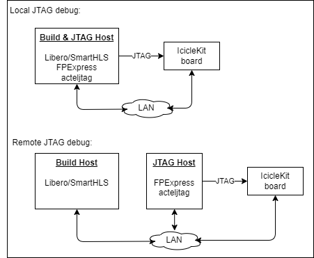

# Automatic On-Chip Instrumentation

- [Automatic On-Chip Instrumentation](#automatic-on-chip-instrumentation)
  - [Introduction](#introduction)
  - [Requirements](#requirements)
  - [Explanation of the Example Design](#explanation-of-the-example-design)
  - [About the Automatic On-Chip Instrumentation Flow](#about-the-automatic-on-chip-instrumentation-flow)
  - [Instrument and Compile](#instrument-and-compile)
    - [Instrumenting the design](#instrumenting-the-design)
    - [Compile \& program hardware](#compile--program-hardware)
    - [Compiling the software](#compiling-the-software)
  - [Part 1: Debugging Mode](#part-1-debugging-mode)
    - [Connecting to the JTAG cable](#connecting-to-the-jtag-cable)
    - [Triggering and capturing data](#triggering-and-capturing-data)
    - [Running the software](#running-the-software)
      - [Exercise 1 - see the submodule delays](#exercise-1---see-the-submodule-delays)
      - [Exercise 2 - see the 0x0FF flag](#exercise-2---see-the-0x0ff-flag)
      - [Exercise 3: FIFO occupancy waveform](#exercise-3-fifo-occupancy-waveform)
  - [Part 2: Monitoring mode with ModelSim](#part-2-monitoring-mode-with-modelsim)
  - [Part 3: Monitoring mode with FIFO dashboard](#part-3-monitoring-mode-with-fifo-dashboard)
  - [Appendix A: Using the Identify GUI](#appendix-a-using-the-identify-gui)


## Introduction

In a SmartHLS project there are now three levels of debug and verification:

1. **Software-only** - Compile the C++ code and run on the host machine (e.g. x86).
2. **Co-simulation** - Use RTL simulation to confirm the results match the software-only run.
3. **On-Chip** - Add probes to the design to see data once the FPGA is programmed (**this example**).

The SmartHLS Automatic On-Chip Instrumentation feature streamlines on-chip debugging and verification by automatically adding probes to ports and FIFOs in the generated Verilog code, eliminating the need for manual instrumentation. This feature enables developers to:

1. Monitor input and output data of HLS modules through port instrumentation
2. Track data flow between subfunctions via FIFO instrumentation
3. Detect critical issues like FIFO overflows, FIFO underflows (not enough data) and pipeline bubbles
4. Optimize FIFO depths to avoid overprovisioning of LSRAM resources

To minimize area overhead, users can control instrumentation scope through configurable `log levels` that specify which class of signals to monitor.


## Requirements

**IMPORTANT:** This is an advanced example. It is assumed that you have completed the previous training modules available in the [examples repository](https://github.com/MicrochipTech/fpga-hls-examples), and have experience with on-chip debugging using ModelSim, Synopsys Identify, and command-line operations.

Before beginning this tutorial, you should install the following software:

- Libero® SoC 2024.2 or later ([Download Page](https://www.microchip.com/en-us/products/fpgas-and-plds/fpga-and-soc-design-tools/fpga/libero-software-later-versions)). SmartHLS™ is packaged with Libero

- The following hardware is required: 
  - PolarFire® SoC FPGA Icicle Kit. Please follow [this link](https://onlinedocs.microchip.com/oxy/GUID-AFCB5DCC-964F-4BE7-AA46-C756FA87ED7B-en-US-13/GUID-1F9BA312-87A9-43F0-A66E-B83D805E3F02.html) to set up your Icicle Kit and make sure Linux boots-up and that the board has an IP network address assigned to it.
  - This example can be used in a `local` or `remote` configuration depending on where the IcicleKit board is connected to via JTAG. The `JTAG_HOST` is the machine that is connected to the board and the `build host` is the machine where the project is compiled. See the following diagram:

  

- Add the following environment variables, and adjust as necessary for your setup:

  - On Linux:

    ```console
    export SHLS_ROOT_DIR="<SMARTHLS_INSTALLATION_DIRECTORY>/SmartHLS"
    export PATH="$SHLS_ROOT_DIR/dependencies/python:$PATH"
    export BOARD_IP="192.168.0.1"
    export JTAG_HOST="127.0.0.1" # for local JTAG debug
    export PROGRAMMER_ID="1234567" # Available from FPExpress
    ```

  - On Windows PowerShell please either use forward slashes (/) or double back slashes (\\\\):

    ```console
    $env:SHLS_ROOT_DIR = "<SMARTHLS_INSTALLATION_DIRECTORY>/SmartHLS"
    $env:PATH = "$env:SHLS_ROOT_DIR/dependencies/python;$env:PATH"
    $env:BOARD_IP="192.168.0.1"
    $env:JTAG_HOST="127.0.0.1" # for local JTAG debug
    $env:PROGRAMMER_ID="1234567" # Available from FPExpress
    ```

    - **KNOWN ISSUE**: In Windows, SmartHLS includes python 3 and the binary name is `pyhton.exe`, however, a TCL script in the SmartHLS2024.2 installation is explicitly calling `python3`, which does not exist. To be able to run the instrumentation example in Windows, just copy the file as follows:

    ```console
    cp "<SMARTHLS_INSTALLATION_DIRECTORY>/SmartHLS/dependencies/python.exe "<SMARTHLS_INSTALLATION_DIRECTORY>/SmartHLS/dependencies/python3.exe`
    ```

**NOTE**: The `JTAG_HOST` variable can be set to `127.0.0.1` if the machine that the board is connected to is the same as the machine where the project is being compiled and debugged.

## Explanation of the Example Design

We have created a simple, yet general example that describes a streaming design pattern to showcase how the SmartHLS Automatic On-Chip Instrumentation feature works. The following is a block diagram of the example architecture where the red dots represent the instrumentation probes that are automatically inserted:


 A typical pipeline starts with a data `producer()`, and the data goes through a series of processing functions, in this case, the `FifoToFifo()` function just forwards the data, but in a real design it can be any stream processing function. Finally, the data is read by the `consumer()`. The `producer()` will start generating a continuos data sequence when the RISC-V CPU sends the `go=1` signal and stop when `go=0`.
 Each instance of the `FifotoFifo()` function and the `consumer()` function have a `delay` argument to artificially create a backpressure in the dataflow and cause the FIFOs to fill up to a level proportional to the delays.  The delays for the pipeline are passed as command-line arguments to the RISC-V binary (.elf file).  Once the RISC-V binary is running, the user can press `CTRL+C` to send the `go=0` signal to the HLS module to stop the execution of the program.

 With this example, users can see on-chip when the RISC-V CPU writes the `go` and `delay` arguments to the HLS module by looking at the `AXI target` ports, or can see how data flows through the FIFOs and how they fill-up.


## About the Automatic On-Chip Instrumentation Flow

From the user perspective, the flow is simple compared to manual instrumentation: just enable the instrumentation flow and adjust the instrumentation parameters as needed.  The rest is handled by SmartHLS.

Here is a high-level diagram of the Automatic On-Chip Instrumentation flow:


The process follows these steps:

1. *Initial Phase*:

   - User writes C++ code.
   - SmartHLS converts the C++ code to Verilog and generates an initial instrumentation specification (`instrument_config.json`)
   - Users can optionally customize the instrumentation configuration

2. *High-Level Instrumentation Phase*:

   - SmartHLS integrates the generated Verilog module into the IcicleKit Libero reference design and runs RTL synthesis. The resulting netlist is not yet instrumented.
   - SmartHLS High-Level Instrumentor then extracts information from the uninstrumented netlist and from the `instrument_config.json` to generate TCL scripts for Synplify to actually instrument the design.

3. *Implementation Phase*:

   - Synplify & Libero apply the generated instrumentation constraints (`identify.idc` file) to generate an instrumented netlist.
   - Libero completes place & route and generates the bitstream

4. *Debugging and Monitoring Phases*:

   Two operational modes are available to capture data from the instrumented design:

   - **Debugging Mode**: Users can set triggers for specific conditions and use Identify to capture data. More interactive.
   - **Monitoring Mode**: Automatic periodic data capture, always trigger without conditions.

5. Visualization Phase:

   - The Update Wave Viewer script processes the captured data (`.vcd` files) and convert it to viewer-specific formats (e.g., .wlf for ModelSim)
   - SmartHLS High-Level Instrumentor generates TCL scripts for optimal signal display in Modelsim:
     - Groups signals by top-level
     - Configures hex notation for address/data buses
     - Displays FIFO occupancy levels as analog waveforms

## Instrument and Compile

### Instrumenting the design

First, to enable the automatic instrumentation, the `Makefile` contains the following line:

```Makefile
HLS_INSTRUMENT_ENABLE=1
```

In a new terminal, remove stale files by running

```console
shls clean
```

Then run the following command to generate a file called `instrument_conf.json`.

```console
shls -a instrument_init
```

This command will automatically run `shls hw` first to convert the C++ code to verilog,
since it is a pre-requisite for generating the `instrument_conf.json` file. This is how it will look like:

```json
{
    "modules": {
        "hlsModule": {
            "log_level": "2",
            "fifo_log_level": "0"
        }
    },
    "dashboard": {
        "max_iterations": -1,
        "show_markers": 1,
        "monitoring_mode": 0,
        "waveform_period": "10"
    },
    "iice_options": {
        "sample_buffer_depth": 1024,
        "iice_name": ""
    }
}
```

The `hlsModule` is the same name of the top-level function as described in the `main.cpp` file:

```CPP
void hlsModule(volatile unsigned char& go,
              unsigned long long int delay1,
              unsigned long long int delay2,
              unsigned long long int delay3,
              unsigned long long int delay4)
{
   #pragma HLS function dataflow top
   ...
}

```

A full explanation of the parameters of `instrument_conf.json` is located in the [User Guide](https://onlinedocs.microchip.com/oxy/GUID-AFCB5DCC-964F-4BE7-AA46-C756FA87ED7B-en-US-13/GUID-0BA4F982-F732-459D-8CAB-C02B0E92879F.html#GUID-0BA4F982-F732-459D-8CAB-C02B0E92879F__GUID-F622374A-37E3-440B-922A-7980536D3130).

**NOTE:** Make sure to clean your project and re-run `shls instrument_init` if you modify the top-level modules of your design, for example, if you want to add a new top-level function.

Now, let's change the log levels related to `hlsModule()`. A lower log level means fewer signals will be instrumented, which in turn saves resources. The same property applies to the FIFO log level. Let's change `log_level` to 3, and the `fifo_log_level` to 3.

```json
"hlsModule": {
            "log_level": "3",
            "fifo_log_level": "3"
        }
```

For the sake of this example, we will only demonstrate log levels 3 and 3 (respectively), but a description of each log level is located in the [User Guide](https://onlinedocs.microchip.com/oxy/GUID-AFCB5DCC-964F-4BE7-AA46-C756FA87ED7B-en-US-13/GUID-0BA4F982-F732-459D-8CAB-C02B0E92879F.html#GUID-0BA4F982-F732-459D-8CAB-C02B0E92879F__GUID-4D55BBE5-2C4C-4533-BA42-68622188A166).

### Compile & program hardware

Next, run Synthesis & Place-and-Route. This can be done with the following command:

```console
shls -a soc_accel_proj_pnr
```

Now program the FPGA with the instrumented bitstream file (`hls_output\soc\designer\MPFS_ICICLE_KIT_BASE_DESIGN\Icicle_SoC.job`). You can use the command line this (make sure you have declared the `PROGRAMMER_ID` environment variable):

```console
shls soc_accel_proj_program
```

Alternatively, you can also use FlashPro Express. If you do, please make sure you close FPExpress after flashing the bitstream, as it may interfere with the debugging process.

At this point the FPGA has been programmed with the instrumented design. Now let's compile the software.

### Compiling the software

You can now cross-compile the `main()` program for the RISC-V CPU by typing:

```console
shls -a soc_sw_compile_accel
```

Then copy the binary (.elf file) to the board:

```console
scp hls_output/auto-instrument.accel.elf root@$BOARD_IP:./
```

Do *NOT* run the `auto-instrument.accel.elf` program yet. Let's first arm the trigger in Identify in the next section.

## Part 1: Debugging Mode

### Connecting to the JTAG cable

To start debugging, we first need to connect to the Icicle Kit board via JTAG. On the `JTAG_HOST` machine (the one where your board is connected to), launch a new terminal and start the Actel JTAG server. You can choose any unoccupied port, we'll use `57123`, but please remember which port you use.

```console
acteljtag -p 57123
```

NOTE: In Windows, if you see an error upon running this command, you may have to use the fully qualified PATH of `acteljtag`. You can find this in Windows PowerShell using

```console
> Get-Command acteljtag
```

*NOTE*: Keep the `acteljtag` server terminal open as occasionally it may get disconnected and may need to be started again.

Now open an interactive shell for Identify Debugger:

On Linux, run

```console
identify_debugger_shell -licensetype identdebugger_actel -shell  hls_output/soc/synthesis/MPFS_ICICLE_KIT_BASE_DESIGN_syn.prj
```

On Windows, run

```console
identify_debugger_console -licensetype identdebugger_actel  hls_output/soc/synthesis/MPFS_ICICLE_KIT_BASE_DESIGN_syn.prj
```

And then you can connect to the JTAG server using the following commands (make sure to use the same port number as before):

```console
server set -addr $::env(JTAG_HOST) -port 57123 -cabletype Microsemi_BuiltinJTAG
server start
com cableoption Microsemi_BuiltinJTAG_port $::env(PROGRAMMER_ID)
com check
```

### Triggering and capturing data

Next, we'll pick a signal to trigger on. As a result from the instrumentation process, you should see that the `Identify Design Constraints` file (`hls_output/soc/synthesis/identify.idc`) has been automatically generated. It contains all the signals that are being instrumented. For example, you may notice the line:

```TCL
{/FIC_0_PERIPHERALS_1/hlsModule_top_0/hlsModule_inst/hlsModule_BB_0_fifo1_inst/genblk1/fwft_fifo_bram_inst/empty}
```

This is a signal that indicates whether or not `fifo1` is empty. We can then set a trigger when this signal transitions from high to low, which would indicate that `fifo1` is not empty.  When this happens, the trigger will inform Identify to start recording sample data every cycle up until the `sample_buffer` is full, which then can be visualized in ModelSim. To do this type:

```console
% watch enable -language verilog  {/FIC_0_PERIPHERALS_1/hlsModule_top_0/hlsModule_inst/hlsModule_BB_0_fifo1_inst/genblk1/fwft_fifo_bram_inst/empty} {1'b1} {1'b0}
```

Finally, arm the trigger:

```console
% run -iice {auto_instrument}
```

Now wait until you see the following in the shell:

```console
Waiting for trigger...
```

This will wait until `inputFifo`'s `empty` signal becomes low but for that we need to run the `auto-instrument.accel.elf`
binary that was compiled earlier.

### Running the software

Now, to run the design on the board, open a `ssh` session to the IcicleKit board:

```console
ssh root@$BOARD_IP
```

Now run the software binary that was copied earlier. The four arguments are the delays for the FIFOs. This will
cause `fifo1` to become non-empty which will, in turn, trigger in Identify.

```console
$riscv> ./auto-instrument.accel.elf 0 0 0 0
```

You should see in the Identify shell that the trigger has been activated. Let's now write the captured data to a `.vcd` file. First press ENTER, and then type:

```console
% write vcd "auto_instrument.vcd" -iice auto_instrument
```

Now in a new terminal window, launch ModelSim by running

```console
vsim -do hls_output/scripts/instrument/vsim_keyboard_shortcut
```

Now, open the ModelSim window and press Ctrl + R to refresh.

You should see the signals for FIFOs arranged and grouped in an intuitive manner. You can expand the `User_Defined_FIFOs` group to see the signals for the FIFOs in the design. For example, here's the grouped signals for `fifo1` (after toggling on leaf names):


#### Exercise 1 - see the submodule delays

Let's take a look at the `empty` and `write_data` signals for `fifo1`, and compare these signals to the corresponding counterparts for `fifo2`, `fifo3`, and `fifo4`. Since we ran the HLS module with all delays set to `0`, we expect to see that the time between two consecutive FIFOs becoming non-empty is very small. Place a cursor at falling edge of the `empty` signal for all the FIFOs. You may have to zoom in a little to get it right. For clarity, we'll remove all the other signals for now, so that we can see the four `empty` signals on top of each other.


Notice that the delay between the falling edges is 60ns. Since a clock cycle is 10ns, 60ns is 6 clock cycles. The reason for this offset in delay is due to some of the control logic in the generated verilog code. In general, expect

- A 6-cycle delay when the delay is 0
- An (9 + N)-cycle delay when the delay is N, for some positive integer N.

To confirm this, kill the executable running on the board by pressing `Ctrl + C`, arm the trigger again, and then rerun the program with all delays set to `1`.

```console
% run -iice {auto_instrument}
```

```console
$riscv> ./auto-instrument.accel.elf 1 1 1 1
```

Then, refresh ModelSim waveform (press `Ctrl + R`), and replace the cursors as before, on the falling edge of the empty signal. You should see the difference is 9 + 1 = 10 clock cycles


*Exercise*: Try with different delays to make sure the design works.

#### Exercise 2 - see the 0x0FF flag

When the SIGINT signal (`Ctrl+c`) is sent to the executable running on the board, the `producer()` function should write `0x0FF` (wordplay for "OFF") to `fifo1` and terminate. When `0x0FF` is seen by the other functions in the pipeline, they too will terminate, effectively ceasing operation of the pipeline completely. Let's confirm this is actually the case.

In the Identify shell, remove the existing trigger.

```console
% watch disable  {/FIC_0_PERIPHERALS_1/hlsModule_top_0/hlsModule_inst/hlsModule_BB_0_fifo1_inst/genblk1/fwft_fifo_bram_inst/empty}
```

Then, trigger on `0x0FF` being written to `fifo1`:

```console
% watch enable -language verilog  {/FIC_0_PERIPHERALS_1/hlsModule_top_0/hlsModule_inst/hlsModule_BB_0_fifo1_inst/genblk1/fwft_fifo_bram_inst/write_data} {32'h0FF}
```

Now run the debugger

```console
% run -iice {auto_instrument}
```

And then, kill the running executable on the board by pressing `Ctrl + C`.

Then, in the Identify shell, the trigger should have been activated. Write to the `.vcd` file by pressing ENTER then running

```console
% write vcd "auto_instrument.vcd" -iice auto_instrument
```

Then, refresh ModelSim (`Ctrl + R`).

You should see the FIFOs becoming empty at the tail-end of the waves.

Let's check what was written to `fifo1` just before it became empty. Look at the last falling edge of `write_en`, and place a cursor just before it (this is the location of the last write). You will have to zoom in.


As expected, we see that the last written word is `0x0FF`.

#### Exercise 3: FIFO occupancy waveform  

A very important signal we have not yet mentioned is the `usedw` signal. This signal counts the number of elements in the FIFO at any given point in time. In this design, we expect that the occupancy of each FIFO grows during the initial delay stage, and then remains constant until the executable running on-board is killed, in which case it will become empty. We will examine the `usedw` signal for when the FIFO occupancy is growing (when the HLS modules is first started), and leave the examination of the `usedw` signal when the FIFO size is shrinking as an exercise to the reader.

First, remove the trigger set in the previous section.

```console
% watch disable  {/FIC_0_PERIPHERALS_1/hlsModule_top_0/hlsModule_inst/hlsModule_BB_0_fifo1_inst/genblk1/fwft_fifo_bram_inst/write_data}
```

Then, add a trigger for `fifo1` becoming non-empty

```console
% watch enable -language verilog  {/FIC_0_PERIPHERALS_1/hlsModule_top_0/hlsModule_inst/hlsModule_BB_0_fifo1_inst/genblk1/fwft_fifo_bram_inst/empty} {1'b1} {1'b0}
```

Then, run the debugger

```console
% run -iice {auto_instrument}
```

Finally, run the executable on the board with all delays set to `12`, then execute
Then, in the Identify shell, write to the `.vcd` file by pressing ENTER then running

```console
% write vcd "auto_instrument.vcd" -iice auto_instrument
```

in the Identify shell to write to the `.vcd`, and then refresh ModelSim (`Ctrl + R`).

First, let's format the `usedw` signal for `fifo1` in ModelSim. Right-click it and hover over `Format`, then select `Analog (automatic)`. Then, right-click it again and hover over `Radix`, then select `Decimal`.

Now you can place a cursor anywhere in the waveform and see the occupancy level of `fifo1`. You will see that the occupancy at the pipeline's stable state is 20. This is because the initial delay of 12 plus the control logic delay of the submodules. In these 21 clock cycles, 20 elements were able to be written before the `FifotoFifo()` function started forwarding data from `fifo1` to `fifo2`.


*Exercise*: Play around with the delays and check that the occupancies of the other FIFOs makes sense intuitively.

Now close ModelSim and the Identify Debugger console.

## Part 2: Monitoring mode with ModelSim

So far, anytime we wanted to test a new delay, we would have to manually arm the Identify trigger, write to the `.vcd` file, and refresh ModelSim. This is an interactive approach where a new capture would overwrite the previous waveform where developers can inspect and experiment with different trigger conditions.

In contrast, in monitoring mode the goal is to have more long-term setting to see how signals change over more prolonged periods of time. For example, to see if FIFOs slowly start growing and eventually overflow.  In monitoring mode the waveforms in ModelSim will update automatically with every new capture of data from the instrumented design and the trigger will happen periodically and with no trigger condition.

Monitoring mode consists of two parts:

- a monitoring process
- a visualizing process
  - with a waveform (using ModelSim)
  - with a bar plot (using Python)

To enable Monitoring Mode, change

```text
set monitoring_mode 0
```

to

```text
set monitoring_mode 1
```

in `hls_output/scripts/update_vcd.tcl`. This indicates to the waveform updating scripts that when we get new data from the debugger, we don't want to refresh the waveform, but rather want to concatenate the new data to the end of the existing waveform.

Then, open a new terminal and start an a monitoring process that periodically captures the data:

```console
identify_debugger_shell -licensetype identdebugger_actel ./hls_output/scripts/instrument/monitor.tcl $PROGRAMMER_ID
```

Finally, open Modelsim in a new terminal for visualization:

```console
$ vsim -do hls_output/scripts/instrument/update_vcd.tcl
```

This will launch ModelSim again, but the waveform will update continuously (no need to press `Ctrl+R` to refresh) as soon as Identify provides new captured data periodically.

Now close ModelSim and the Identify Debugger console.

## Part 3: Monitoring mode with FIFO dashboard

When writing C++ to design a hardware module, it may not be clear at first how deep your FIFOs need to be. On the one hand, if they are too shallow, then you will have a lot of data backup (backpressure). And, if they are too deep, then you may be overprovisioning and wasting area.

The FIFO Monitoring Dashboard aims to show developers, in nearly real-time, how filled up their FIFOs are getting as their program executes. It does so in an intuitive manner using a bar graph, where each bar represents a FIFO.

Start the monitoring loop that will generate the periodic captures:

```console
identify_debugger_shell -licensetype identdebugger_actel hls_output/scripts/instrument/monitor.tcl $PROGRAMMER ID
```

Finally, open a new terminal and launch the FIFO Monitoring Dashboard:

```console
shls -s instrument_monitor_fifos
```

Now, when you run the `auto-instrument.accel.elf` executable on-board, you should see the bar graph changing according to how full the FIFOs are. Try playing around with different delays and see how this affects the bar graphs. The occupancies should match the values you see for the `usedw` signal in ModelSim, for the FIFO dashboard is simply a python-based visualization of this signal!

The bar graph should periodically change as it receives data from the monitoring process. The timestamp at the top of the plot indicates the time the plotted data was created by the monitoring process.

You might notice a few shallow FIFOs on the left of the screen with very long names. These are `infrastructure FIFOs`, and are part of SmartHLS's AXI hardware design IP. The rightmost four FIFOs are `user-defined FIFOs`, and are the ones described in the C++ code and the ones you'll want to pay attention to.

**NOTE**: Please be advised that the FIFO Dashboard feature is currently in an experimental phase. Use it with caution and anticipate potential minor issues

Here are some examples of the bar plot. You should confirm these make sense intuitively.

- When the executable is not running on-board, all FIFOs are empty:

  

- When the delays are 20, 40, 80, and 160, respectively:
  
  ```console
  $riscv> auto-instrument.accel.elf 20 40 80 160
  ```

  

- When the delays are 220, 20, 150, and 80, respectively:

  ```console
  $riscv> auto-instrument.accel.elf 220 20 150 80
  ```

  

## Appendix A: Using the Identify GUI

In this tutorial, we only demonstrated how to set triggers and configure the client-server connection using the Identify shell. However, all of this can also be done with the GUI. You can launch the GUI by opening a new terminal and running

```console
identify_debugger -licensetype identdebugger_actel hls_output/soc/synthesis/MPFS_ICICLE_KIT_BASE_DESIGN_syn.prj
```

Then, you can configure the client-server connection by clicking *`Debugger > Setup debugger...`* dialog, and then visiting the *`Communications`* tab to connect to the JTAG server.


To trigger and run the debugger, you should find the correct signals you wish to trigger on, right-click it, hover over *`Triggering`*, and customize your trigger appropriately. Then, hit the big *`Run`* button at the upper-left side of the window. For example, here's how you can trigger on `fifo1` becoming non-empty and then run the debugger:


