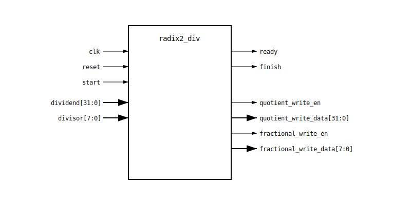

# Unsigned Division Using Radix-2 Algorithm

This example demonstrates how SmartHLS can be used to generate a divider for two
unsigned numbers using the Radix-2 algorithm. This algorithm is simple yet very
efficient for hardware implementation.

## Setup

After cloning the repo, go to the example directory and source the environment script:
After cloning the repository, navigate to the example directory and source the environment script:

From a Windows PowerShell terminal:

```powershell
cd radix2_div
. C:\Microchip\Libero_SoC_v20XY.Z\SmartHLS-20XY.Z\SmartHLS\bin\setup_shls_path.ps1
```

NOTE: You may need to run following command to allow script execution in PowerShell

```console
set-ExecutionPolicy Unrestricted
```


## Run the example

This will run the software-only run on the host machine:

```console
shls -a sw
```

You should see something like:

```console
Info: Running the following targets: sw_compile sw
Info: Compiling Software...
Test: [PASS] Dividend = 250, Divisor = 7, Quotient = 35, Fractional = 0xb6
Test: [PASS] Dividend = 1000, Divisor = 8, Quotient = 125, Fractional = 0x0
Test: [PASS] Dividend = 4294967295, Divisor = 1, Quotient = 4294967295, Fractional = 0x0
Test: [PASS] Dividend = 500, Divisor = 0, Quotient = 4294967295, Fractional = 0xff
Test: [PASS] Dividend = 5, Divisor = 10, Quotient = 0, Fractional = 0x80
Test: [PASS] Dividend = 4294967295, Divisor = 255, Quotient = 16843009, Fractional = 0x0
Test: [PASS] Dividend = 1234, Divisor = 16, Quotient = 77, Fractional = 0x20
Test: [PASS] Dividend = 10, Divisor = 3, Quotient = 3, Fractional = 0x55
```

## Run HW generation & RTL synthesis

Just call the `rtl_synth` target, which will automatically call the Verilog
generation and then run RTL synthesis to determine the resource usage.

```console
shls -a rtl_synth
```

The summary reports can be found under `hls_output\reports` directory.

The Verilog module will be like this:

