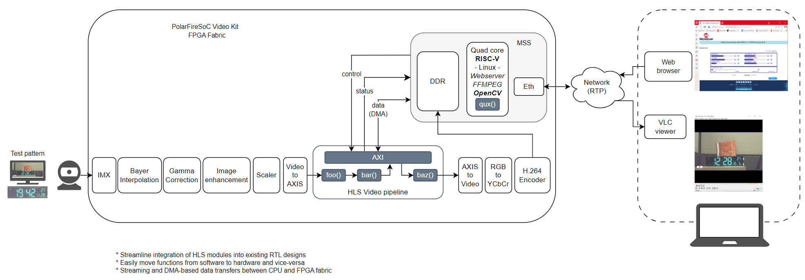
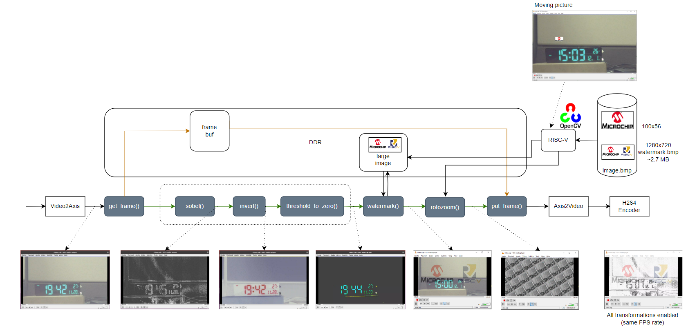

  # End-to-end SmartHLS + RISC-V + H264 over Ethernet Example

This SmartHLS example is meant to show how to perform simple, real-time and live 
video processing within an end-to-end system including the interaction and 
collaboration between RISC-V processors and the FPGA in the 
[PolarFireSoC Video Kit](https://www.microchip.com/en-us/development-tool/mpfs250-video-kit).

## Example Architecture

This example was created using the [AN4529 AppNote](https://ww1.microchip.com/downloads/aemDocuments/documents/FPGA/ApplicationNotes/ApplicationNotes/PolarFire_SoC_FPGA_H264_Video_Streaming_Over_Ethernet_Application_Note_AN4529.pdf)
as starting point. The application note was modified and extended to include 
functions to process the video frames on the FPGA fabric or the RISC-V CPU using 
SmartHLS.

The following figure describes the overall example architecture. There is a camera
connected to the project that goes through some RTL-based processing modules 
(bayer interpolation, gamma correction, enhancement and scaling), which are part 
of the original AppNote. Then the video frames go though some additional 
processing (HLS modules) before they get encoded by the H264 module.  The RISC-V
processor then encapsulates the encoded frames into RTP packets and stream them
over the network. The video can be watched using a video player and the entire 
design can be controlled via web.



As a general concept, the HLS pipeline in the figure shows some hypothetical 
C++ functions, shown as gray boxes, that can be compiled using SmartHLS and target 
either the FPGA fabric or the RISC-V processors. Functions `foo()`, `bar()` and `baz()` 
would be converted to Verilog, and function `qux()` is compiled using the RISC-V 
compiler and executed by the processors.  

The `AXI` box in the figure represents an interconnect that is automatically 
instantiated in the project and the HLS modules are automatically connected to it. 
This interconnect allows the communication between the processor and the HLS 
modules.

# The SmartHLS Processing Pipeline

The actual set of functions that compose the SmartHLS pipeline in this example 
and the effect of each transformation can be seen in the following figure:



The processing functions were chosen to range from simple, like the pixel inversion,
to a bit more complex, like sobel and rotozoom.  The intention of this example is 
to focus on the overall compilation flow and demonstrate a usage pattern rather 
than achieving the best possible transformations. In the end, the idea is to 
let developers replace these transformations with their own. 


The design has two datapaths that the video frames can go through. One path is 
through the DDR memory such that CPU can process the video frames, and the other 
path is through the FPGA fabric. The video frames are steered via the `get_frame()` 
and `put_frame()` C++ functions and controlled by the CPU.

The second data path uses the FPGA fabric, the CPU can enable or disable each function 
independently. When a specific function is disabled, then the video frame is just 
forwarded to the next module.

One additional transformation that only happens on the CPU path is that a small 
Microchip logo bounces around the screen as it is overlaid on top of the 
video frames from the camera. This is useful to show some activity in the background 
when the frame rate slows down as the CPU has to perform additional transformations.

Following is a brief description of the individual transformations:

## get_pixel()

This function can be thought of as a demux module. It receives a video stream 
and either forwards it downstream or writes it to DDR memory depending on an option 
set by the user in the GUI. The memory pointer is passed to the module by the 
RISC-V CPU after the buffer has been allocated.

## put_pixel()

This function can be thought of as a mux module taking video frames from either
the DDR memory or from the internal stream depending on a user setting and 
forward the data downstream. The memory pointer is passed to the module by the 
RISC-V CPU after the buffer has been allocated.

## invert()

The simplest of the transformations, this function simply invert the pixel values.

## threshold_to_zero()

This function takes a threshold value and those pixels whose value is below the 
threshold will have their value set to zero.  As simple as it is, this function 
is used to demonstrate how a the value from "slider" bar in the control GUI 
(web page) can be read and pass down to the HLS module in the FPGA by using the 
SmartHLS autogenerated software API for this module.

## sobel()

Slightly more complex than the previous two functions, sobel is commonly used as 
part of edge detection algorithms. The function internally converts the RGB color 
pixels into grayscale pixels before applying the filter. 


## watermark()

This functions uses a large image (RISC-V + Microchip logos) and performs an 
alpha blend transformation with the incoming video frames from the camera and 
forwards the result. 

This functions is used to demonstrate two aspects: 
1. How a large image (~2.7MB), which is larger than all the available RAM on the 
  FPGA fabric and therefore not possible to store it locally, can be constantly 
  transferred using a mini DMA (AXI Initiator read requests) and still be able to 
  keep up with the frame rate. 
2. How to allocate memory buffers, use OpenCV to load the image and pass the pointer 
  to the HLS module in the FPGA.

## rotozoom()

This function first performs a 512x512 cropping operation of the input video frames, 
such that the cropped image can be stored locally in the FPGA on-chip RAM resources,
and then it performs a texture map operation. The mapping operation stitches a 
mosaic of the cropped image, then rotates it and then performs a zoom operation. 

This function is meant to demonstrate the frame-by-frame collaboration between 
the RISC-V processor, which computes the amount of rotation and the amount of zoom
for each frame, then pass that information to the rotozoom module in the FPGA 
to perform the texture map operation. 

# Example Setup

This section includes the instructions on how to setup the PolarFire SoC Video Kit
board and then how to run the example using the precompiled binaries located under
the `precompiled` directory. These binaries include the bitstream (.job file), the 
Linux image (.wic.gz file), the SmartHLS application executables (.elf files) and 
FFMPEG and OpenCV libraries, which need to be downloaded first, see [Downloading software dependencies](#downloading-software-dependencies).


If you want to recompile all the binaries follow the [Readme-compile.md](Readme-compile.md) 
file instead. However, it is **strongly** advised to try the precompiled version 
first to make sure the board, the environment and the required network 
connectivity has been setup correctly before making any changes.

**NOTE: The precompiled bitstream will only work in boards with Production Silicon,
not with Engineering Sample silicon. If your board has the later, you will need to
update the parameters and recompile the bitstream.**

## Downloading Software Dependencies

The precompiled libraries are included with your installation of SHLS, under `<SmartHLS INSTALLATION DIR>\smarthls-library\external\vision\precompiled_sw_libraries`.

## Board Setup

Before running this SmartHLS example the board needs to be ready by performing the 
following tasks using the files under the `precompiled` directory:

1. Flash the precompiled Linux image (`core-image-minimal-dev-sev-kit-es.wic.gz`)
2. Program the precompiled bitstream (`SEVPFSOC_H264.job`)
3. Have a network IPv4 address assigned to the board

If this is done already you can go directly to [Setup SmartHLS Example](#setup-smarthls-example).
Otherwise, continue to the following sections.

## Flashing the Board

The precompiled embedded Linux image contains the necessary video drivers to use the camera.  

**NOTE: As your board may have a different Linux image, it is strongly 
suggested to flash  it with the precompiled Linux image for this example.**

To flash the image, you need 3 terminals:
- Host PC terminal
- Board HSS serial UART terminal
- Board Linux serial UART terminal

To use the serial UART terminals connect a USB cable between your host PC and 
the board to connector `J12`. Then you can launch the terminal emulation program 
and configure it to use a baud rate of 115200, 8-bits of data, no parity and 1 
stop bit (8-N-1). You can use the terminal program of your choosing, on Windows
you could use [Putty](https://www.putty.org/), and on Linux you could use 
[tio](https://github.com/tio/tio).

You will also need to connect another USB cable between your Host PC and the board 
in connector `J19`. This is needed to be able to write to the eMMC flash memory on
the board.

### Flashing the Board on a Linux Host PC

In the Host PC Linux terminal, enter the command `ls /dev/sd*`, and take note of 
what appears. This will be used in a later step to help determine the device name 
of the eMMC flash memory. To flash the Linux image we first need to expose the eMMC 
flash memory as a USB storage device to the host PC.

To open the HSS serial UART terminal you can type the following (replace the device 
in your host PC, which may be different than in the example):
```bash
tio -b 115200 /dev/ttyUSB0
```

To open the on-board embedded Linux serial UART terminal you can type the following in 
another terminal (replace the device in your host PC, which may be different 
than in the example):
```bash
tio -b 115200 /dev/ttyUSB1
```

**NOTE: The exact ttyUSBx devices may change depending on other devices that may 
be connected to the same host computer.** 

Reset the board by typing the `reset` command in the HSS serial terminal. 
In the HSS serial terminal, when prompted to `Press a key to enter CLI`, 
press any key aside from ESC. If you don’t press a key within 1 second then the board 
will continue to boot Linux and you will have to reset the board again. 

Once the HSS command line interface is up, enter the `mmc` command
to select the eMMC flash memory. Then enter the `usbdmsc` command to connect the
board to your host PC as a USB storage device. If the board is properly connected
to your host computer, you should see messages in the HSS terminal about data being read.
You are now ready to flash the Linux image to the board. 

In the Host PC Terminal, type the `ls /dev/sd*` command again, and compare with what you saw in the earlier
step. Note which device has showed up, as it will be the eMMC flash memory on the
board. Alternatively, you can type:

```
sudo lshw -class disk -short
```

and look for the device named PolarFireSoC. The Linux image files are provided in 
the compressed file. We will use the [bmaptool](https://github.com/intel/bmap-tools) 
to program the Linux image (replace `/dev/sdb` with the device you got for the 
eMMC flash memory):

```bash
bmaptool copy core-image-minimal-dev-sev-kit-es.wic.gz /dev/sdb
```

After the flashing command completes, you should disconnect the mounted drive, 
by typing `Ctrl+C` in the HSS serial terminal. The Linux image on the board is 
now updated.

### Flashing the Board on Windows

On Windows, you can either use a program like [Balena's Etcher](https://etcher.balena.io) 
or use a shell that can run the the `zcat`, such as Cygwin, to program the flash memory.

<ins>Using Balena Etcher<ins>

Reset the board by typing the `reset` command in the HSS 
serial terminal, which you can open using Putty.  In the HSS Serial terminal, 
when prompted to `Press a key to enter CLI`,  press any key aside from ESC. 
If you don’t press a key within 1 second then the board will continue to boot 
Linux and you will have to reset the board again. 

Once the HSS command line interface is up, enter the `mmc` command
to select the eMMC flash memory. Then enter the `usbdmsc` command to connect the
board to your host PC as a USB storage device. If the board is properly connected
to your host computer, you should see messages in the HSS terminal about data 
being read. You are now ready to flash the Linux image to the board.

Open Balena's Etcher and click on `Flash from file`. This will open a window to select
the file you want to flash. Choose `core-image-minimal-dev-sev-kit-es.wic.gz` provided
in this example. Then click on `Select target` and choose the board's flash memory drive.
The drive should have been detected by Windows when you issued the `usbdmmc` command.
Once you have set the target and file, click on `Flash!` and wait for the image file to
be flashed on the memory.

After the flashing command completes, you should disconnect the mounted drive, 
by typing `Ctrl+C` in the HSS Serial Terminal. The Linux image on the board is 
now updated.

<ins>Using `zcat`<ins>

To open the Host PC Terminal users should open their shell and 
choose “Run as administrator”. Administrator rights are required to flash the 
Linux image to the board.

Enter the command `ls /dev/sd*`, and take note of what appears.
This will be used in a later step to help determine the device name of the eMMC flash memory.
To flash the Linux image we first need to expose the eMMC flash memory as a USB 
storage device to the host PC. Make sure you have connected the `j19` USB port on
the board to your PC. 

Type the `ls /dev/sd*` command again, and compare with 
 what you saw in the earlier step. Note which device has showed up, as it will be 
 the eMMC flash memory on the board. 
 
To use `zcat` command, navigate to the example folder and
use the following command (replace `sdx` with the new sd device name you have for the
flash memory):

```bash
zcat core-image-minimal-dev-sev-kit-es.wic.gz | dd of=/dev/sdx bs=4096 iflag=fullblock oflag=direct conv=fsync status=progress
```

After the flashing command completes, you should disconnect the mounted drive, 
by typing `Ctrl+C` in the HSS Serial Terminal. The Linux image on the board is 
now updated.

**NOTE:** 
As an additional reference about terminals and the image flashing process,
you can check the [IcicleKit Setup Instructions](https://onlinedocs.microchip.com/v2/keyword-lookup?keyword=hls_iciclekit&redirect=true&version=latest). 
It includes instructions and additional screen captures for the PolarFire Icicle 
kit but the the process is similar in the PolarFire SoC Video Kit, except they 
use different image files.

## Program the Pre-compiled Bitstream

You can use Microchip's FPExpress GUI to program the pre-compiled `SEVPFSOC_H264.job` 
file. 

This bitstream include the required version of the HSS software. After programming 
the bitstream the RISC-V processors will reboot and you should see in the HSS 
terminal the following text: `"RISCV Summit 2022 version"`, otherwise the bitstream
was not programmed correctly.

## Setup Static IP Address 

Follow these steps after the Linux image has been flashed onto the board.

On the board there are two Ethernet interfaces, let's use eth0, which is the once 
closest to the camera.

Edit this file
```
sudo vim /etc/systemd/network/70-static-eth0.network
```

With the following content (adjust as necessary):
``` 
[Match]
Name=eth0
 
[Network]
Address=192.168.2.1/24
Gateway=192.168.2.100
DCHP=no
```
The gateway can be the IP address of your host PC.  Then restart the network
```
$> sudo systemctl restart systemd-networkd
$> networkctl status
```

You can test the connection by trying to ssh into the board:

```
ssh root@192.168.2.1
```

## Setup SmartHLS Example

Now that the Linux image is flashed, the bitstream is programmed, and the network 
has been setup correctly, let's setup the software for the example. 

In Section [Setup static IP address](#setup-static-ip-address) the board IPv4 
address was set to `192.168.2.1`. If you changed that, then open the `setup.sh` 
or `setup.bat` file, depending on if you're using Linux or Windows, and adjust the `BOARD_IP` 
variable accordingly. After that run the setup 
script from a command-line terminal under the `precompiled` directory. If you are 
using Linux, run:
```
bash> cd precompiled
bash> setup.sh
```
If you are using Windows, run:
```
cd precompiled
setup.bat
```

This script will copy the OpenCV and FFMPEG libraries, the files for the control 
web page, the SmartHLS application executables and some configuration files to 
the board.

Now you can reboot the board by typing the `reset` command in the HSS terminal or
power cycling the board.
## Running the Example

After the setup is done, open a Web browser and access the following URL just 
replace the IPv4 address as needed:

```
http://192.168.2.1/test/h264/index.htm
```

You should see the SmartHLS example GUI show up. Then you can click on the `Start`
button and at the top-left corner you should see the Frames-Per-Second counter 
changing. Otherwise, something went wrong during the setup process. 

To watch the streaming video, click on the `SDP File` button at the bottom-right
corner and open it with the VLC software or any other Video player that supports
that format. 

The SDP file can also be saved and opened using `ffplay` by typing the following 
command:

```
ffplay -protocol_whitelist file,rtp,udp -reorder_queue_size 0  -fflags discardcorrupt -fflags nobuffer -flags low_delay -i ./video.sdp
```

You can get ffplay from [this link](https://ffmpeg.org/download.html)

**IMPORTANT NOTES:** 

- Make sure to click the `Stop` button before switching between the CPU 
and FPGA data paths in the top-right corner of the webpage. Once the desired path 
is selected, then click the `Start` button again.

- Only try the invert and threshold_to_zero transformation on the CPU path, 
the other transformations are too slow. 
